# intyy — project context brief

> **What this is.** A short, skimmable summary of every key decision about intyy.
> **Who it is for.** Someone who has read the interface.ai take-home brief, and nothing else.
> **Diagrams** use Mermaid. They render on GitHub.
> **Status:** architecture locked, v1.6, 25 Sep 2026. Section 19 lists decisions made after the first draft. Section 21 lists changes from section 2. Section 23 lists changes from section 3. Section 24 lists changes from section 4. Section 25 lists changes from sections 5 to 7. Section 26 lists changes from section 8. Section 27 lists changes from section 9.
> **Artifact fields:** `intyy-section-2-artifact-schema.md` is the source of truth. This doc gives the summary only.
> **Run outputs** (request, result, log, evidence): `3-intyy-run-outputs.md` is the source of truth.
> **Safety** (policy, allowlist, risk rules, secrets, redaction): `4-intyy-safety-policy.md` is the source of truth.
> **Handler packs and error ladder** (handler format, jev, reviewer limits, learned handlers): `5-intyy-handler-packs-and-error-ladder.md` is the source of truth.
> **Discovery and recorder** (observation format, LLM prompt, action tools, recorder rules): `6-intyy-discover-and-recorder.md` is the source of truth.
> **Replay engine and handoff** (wait rules, clue voting, retries, control lease, intervention request): `7-intyy-replay-engine-and-handoff.md` is the source of truth.
> **Trust and versions** (score store, certify, approval, resolver, drift, model trust): `8-intyy-trust-and-versions.md` is the source of truth.
> **Interfaces** (ports, file locations, CLI commands, locks): `9-intyy-interfaces.md` is the source of truth.

---

## Contents

1. [The 30-second version](#1-the-30-second-version)
2. [The core bet](#2-the-core-bet)
3. [Words you need](#3-words-you-need)
4. [Architecture at a glance](#4-architecture-at-a-glance)
5. [Discovery: how intyy learns](#5-discovery-how-intyy-learns)
6. [The artifact: the recipe card](#6-the-artifact-the-recipe-card)
7. [Replay: how intyy repeats](#7-replay-how-intyy-repeats)
8. [When things go wrong: the error ladder](#8-when-things-go-wrong-the-error-ladder)
9. [Handler packs: skills for replay](#9-handler-packs-skills-for-replay)
10. [Human handoff](#10-human-handoff)
11. [Safety](#11-safety)
12. [Seeing the screen](#12-seeing-the-screen)
13. [Confidence, approval, and drift](#13-confidence-approval-and-drift)
14. [Many banks, many surfaces](#14-many-banks-many-surfaces)
15. [Tech stack](#15-tech-stack)
16. [How we verify it](#16-how-we-verify-it)
17. [Build plan](#17-build-plan)
18. [Built, designed, or cut](#18-built-designed-or-cut)
19. [Decisions locked after v0](#19-decisions-locked-after-v0)
20. [Next: the bank app contract](#20-next-the-bank-app-contract)
21. [Changes from section 2](#21-changes-from-section-2)
22. [Design plan](#22-design-plan)
23. [Changes from section 3](#23-changes-from-section-3)
24. [Changes from section 4](#24-changes-from-section-4)
25. [Changes from sections 5 to 7](#25-changes-from-sections-5-to-7)
26. [Changes from section 8](#26-changes-from-section-8)
27. [Changes from section 9](#27-changes-from-section-9)

---

## 1. The 30-second version

- **Problem:** banks run old apps with no API. AI agents still need to use them.
- **intyy's answer:** an LLM learns a task once. We save what it did as a recipe. Plain code repeats the recipe.
- **When the recipe hits trouble:** a ladder of helpers, cheapest first. A human is the last rung.
- **Every action, always:** passes one safety gate.

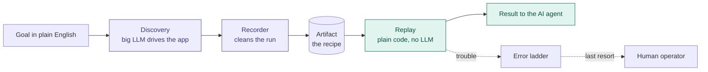

> **Purple = learn once. Teal = run many times.**

---

## 2. The core bet

> **In one line:** the model is a compiler, not a runtime.

| | Discovery | Replay |
|---|---|---|
| How often | Once per task | Thousands of times |
| Model in the loop | Yes, big LLM | No |
| Speed and cost | Slow, costly | Fast, cheap |
| Same result every time | No | Yes |

### Three facts from the brief that shape everything

- **Bank UIs change slowly.** So a recording stays valid for months.
- **Runtime is messy.** Timeouts, "not found", surprise dialogs. We spend our effort here, not on UI drift.
- **Many banks run the same vendor app.** So one recipe should serve many banks, with small overrides.

---

## 3. Words you need

| Word | Meaning |
|---|---|
| **Discovery** | The LLM figures out a task on the live app, once |
| **Artifact** | The saved, typed recipe for one task. Also called a capability |
| **Replay** | Running an artifact with plain code. No LLM decides anything |
| **Fingerprint** | Many clues about one button or field: role, name, label, text, position, picture |
| **Target** | One named control in an artifact, with its fingerprint |
| **Condition** | A named rule about what the screen shows. One shared format for all screen checks |
| **Precondition** | "Am I on the right screen?" A condition checked before a step |
| **Checkpoint** | "Did the step work?" A condition checked after a step |
| **Handler pack** | A bundle of "if you see X, do Y" rules for known interruptions |
| **Error ladder** | The ordered list of helpers when replay hits trouble |
| **jev** | A fast, cheap model that returns typed answers, not prose. Our error sorter |
| **Reviewer LLM** | A bigger model that may fix one stuck step. Rarely used |
| **Control lease** | Who drives the browser right now: bot, human, or nobody |
| **Certify** | Replaying one key many times on a test environment, with faults, and judging each run against truth |
| **Key** | Exact capability version, tenant, app version, and patch revision. What approval names |
| **Batch** | All certify runs from one command, for one key |
| **Verdict** | The scorer's judgment of one certify run: `pass`, `explained`, `assisted`, `unexplained`, `wrong`, or `void` |
| **Gate** | The rules a batch must pass before a human may approve |
| **Fragile step** | A step whose control only just wins the vote. Lowest margin below 0.30, or winner score below 0.85 |
| **Harness** | An app's test-only controls: reset, faults, fault log, oracle. Certify only |
| **Certify suite** | The reviewed test cases for one capability major |
| **Tenant** | One bank or credit union |
| **Context** | One tenant plus one app version. Approval and scores are per **key**: a context plus an exact version and patch revision |
| **Tenant patch** | A small file that changes a few targets or conditions for one bank |
| **Candidate** | A draft artifact a human can still change |
| **Sealed** | A frozen artifact. Nobody edits it again |
| **Score store** | Files that hold approval, scores, tuned timeouts, and autonomy per key. Three files per key |
| **Live score** | Clean runs over counted runs, across the last 50 real runs of a key |
| **Regression batch** | A short certify on approved keys, before a shared part changes |
| **Alert** | A drift finding written for an operator |
| **Resolver** | Picks the right artifact version and patch for a context |
| **Request ID** | The caller's own ID for one request. Makes repeats safe |
| **Mode** | `supervised` (human confirms the start) or `unattended` |
| **Authorization** | Proof that someone agreed to the irreversible step |
| **Commit state** | Whether the irreversible action went out, and what is known about it |
| **Run log** | One JSONL file per run: one line per event |
| **Frozen facts** | Everything that shapes a run, fixed at its start |
| **Delivery window** | How long raw sensitive outputs stay in memory |
| **Evidence level** | How much a run captures |
| **Policy layer** | One policy file: global, app, or tenant. Lower layers only tighten |
| **Bank settings** | Per-bank facts: app addresses, app versions, secret sources |
| **Network guard** | A browser filter that blocks requests outside the allowlist |
| **Masked view** | The screen after redaction. What logs store and what the LLM sees |
| **Per-run token** | A numbered mask, like `[name#1]`. Same value, same token, one run only |
| **Helper window** | Whether handlers, retries, or the reviewer may act now. Closed while a non-`idempotent` action is in flight |
| **Resume rule** | The plain-code rule for where replay continues after a fix |
| **Pre-commit sweep** | One check of every handler detector, just before the irreversible click |
| **Fixture** | A saved, masked screen used to test a handler's detector |
| **Draft handler** | A proposed handler from the recorder, a takeover, or a reviewer fix. Never loaded by replay |
| **Session capability** | A `read_only` capability that signs in. Recorded once per app |
| **Prelude** | Running the session capability before a task's steps, in the same browser |
| **Run spec** | The internal file that starts a discovery run |
| **Watcher** | A read-only check that runs while a human drives |
| **Reverify** | The bot's checks after a handback, before it acts again |
| **Mailbox** | Files the engine and the operator CLI use to exchange requests and decisions |
| **Fake twin** | A test adapter for a port. It needs no live tool |
| **Eyes, hands** | The two halves of the surface port. Only the gate holds the hands |
| **Masked value** | A value that went through redaction. Models and logs accept only these, by type |
| **Library** | Reviewed, sealed files, in git |
| **State** | Runtime files: scores, evidence, locks, mailboxes. Not in git |
| **Publish** | Copying chosen runs and records into the repo's `/evidence/` |

---

## 4. Architecture at a glance

> **In one line:** a core that knows nothing about browsers or models, with plug-in edges.

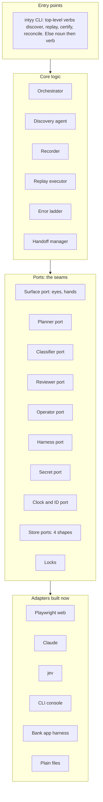

### Why this shape

- **New surface or new storage = new adapter.** The core does not change.
- **Every adapter has a fake twin for tests.** CI never calls a live model.
- **Every action crosses the safety gate** before it reaches the surface adapter.
- **The harness port is reached only by the certify runner and scorer.** A CI test proves no replay-path module imports it.
- **The gate is the only module that receives the hands.** A CI test checks the imports.
- **Every port has a contract test** that runs against the real adapter and its fake twin.

### The components

| Component | Job |
|---|---|
| Orchestrator | Owns each run: state, current step, stop conditions, result |
| Session host | Owns the live browser and the control lease |
| Perception | Reads the screen, acts on it, captures fingerprints, finds targets |
| Safety gate | Allowlist, risk check, secret injection, redaction |
| Discovery agent | The big LLM loop: look, decide, act |
| Recorder | Turns a messy run into a clean draft artifact |
| Replay executor | Walks the artifact step by step |
| Error ladder | Decides what happens when a step fails |
| Handoff manager | Pauses runs, asks humans, resumes safely |
| Certify runner | Plans and runs batches on test environments, with faults |
| Scorer | Judges each certify run against the fault log and the oracle. Applies the gate |
| Drift reader | Reads live lines, degrades keys, writes alerts, drafts patches |
| Stores | Artifacts, tenant patches, handler packs, scores, suites, test data sets, fault profile sets, threshold records, major records, alerts, evidence. All plain files. Evidence splits by tenant; `run.json` is the stored result |

---

## 5. Discovery: how intyy learns

> **In one line:** look, decide, check, act, write it down. Repeat until done.

**Example goal used everywhere below:** "Open a savings sub-account for member 10234 with a $100 deposit. Return the new account number."

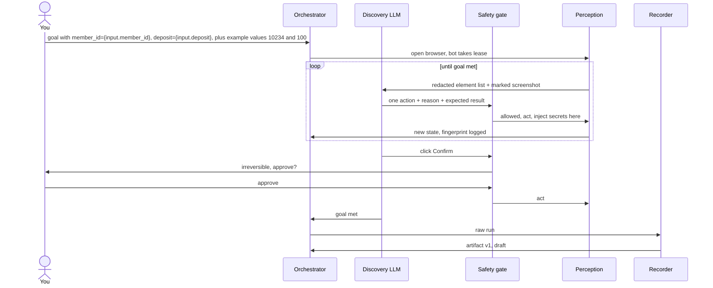

### Rules that matter

- **The LLM never sees secrets.** It names `{secret.operator_login}`. The safety gate types the real value.
- **Callers never name secrets.** Bank settings supply the values. Artifacts only refer to names.
- **The LLM picks from element IDs,** not pixel positions. Each ID maps to a durable fingerprint.
- **Irreversible clicks need a human yes,** even in discovery.
- **The operator's approval answer carries a risk hint:** irreversible, reversible, idempotent, or decline.
- **The LLM never sees input values.** It sees and types `{input.member_id}`, never `10234`. The gate puts in the value.
- **The log writer still replaces known values in observed screen text** with references. The recorder relies on it.
- **Discovery runs on `test` environments by default.** A bank must opt in to production discovery.
- **Negative discovery runs capture business outcomes.** Run with a known-bad input and state the expected outcome. A human names the outcome code.
- **Signing in is its own capability.** Other discovery runs start after the prelude.
- **The LLM sees a marked screenshot:** element ID tags drawn on the masked picture.
- **No handlers run during discovery.** The recorder must see interruptions.
- **The operator declares inputs, outputs, and expected effect.** The LLM cannot invent outputs.

### What the recorder does

- **Drops noise:** dead ends, retries, and incidental popups.
- **Turns popups into draft handlers:** "if you see this popup, click Stay signed in."
- **Reads the redacted discovery log alone.** Values are already named inputs there. It never needs raw member data on disk.
- **Keeps each control's fingerprint** as a named target, and derives conditions.
- **Preconditions are screen conditions.** Clicks also check every fill on the same screen.
- **Checkpoints must be false before the action and true after.**
- **Drafts a risk flag per step:** idempotent, reversible, or irreversible. A human confirms each one.
- **Declares outputs** with types. Sensitivity labels come from policy rules, not the LLM.
- **Writes a candidate.** A human reviews it through the CLI, then it is sealed and never edited again.
- **The candidate is regenerated after each review decision.** No hand edits.

---

## 6. The artifact: the recipe card

> **In one line:** a typed contract an agent can call, plus the steps to fulfil it.

### What is inside: ten blocks

| Block | Contains |
|---|---|
| `schema` | Version of the file format |
| `identity` | App, capability, version. The unique key |
| `runs_on` | Surface, app versions, viewport, entry path |
| `about` | Plain summary for humans and the calling agent |
| `contract` | Typed inputs, typed outputs, business outcomes like `member_not_found`, and effect: `read_only` or `commits` |
| `targets` | Named controls, each with a fingerprint |
| `conditions` | Named screen checks, in one shared format |
| `steps` | The ordered recipe |
| `recovery` | Commit point, reconciliation check, undo link. Only when effect is `commits` |
| `provenance` | Source runs, LLM tags, human decisions |

- **Approval state is not in the artifact.** Approval is per context, so it lives in the score store.
- **Full field list:** `intyy-section-2-artifact-schema.md`.

### One step

| Field | Example |
|---|---|
| ID | `click_search`. A stable name, never a number |
| Intent | "Search for the member" |
| Action | Click the target `search_button` |
| Precondition | Condition `member_id_entered` |
| Checkpoint | Condition `one_result_row` |
| Outcomes | Business outcomes possible here: `member_not_found` |
| Risk | Idempotent, reversible, or irreversible |
| Timeout | Default wait. Tuned values live in the score store |

- **Fingerprints moved to `targets`.** Steps and conditions refer to them by name.
- **Reading a value is its own step,** with a `read` action.

### Where outcomes live

- **Task-specific outcomes live in the artifact.** "Member not found" belongs to the lookup task.
- **App-wide interruptions live in handler packs.** "Session timeout" belongs to the app.

### Lifecycle

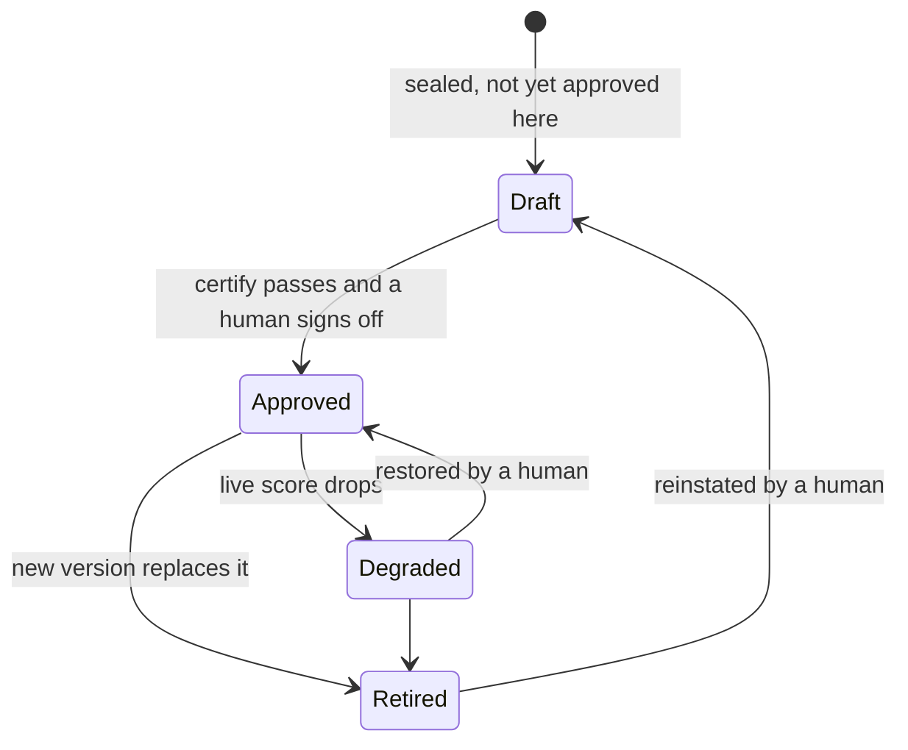

- **Before this:** the recorder writes a candidate. A human reviews it. Then it is sealed.
- **These states are per context,** not per file. Bank A may approve a version that Bank B has not.
- **One approved key per context and major.** Approving a new key retires the old one.
- **Degraded blocks unattended runs.** Supervised runs still work.
- **Degraded to approved:** a human restores it, with a fresh passing batch or after excluding runs.
- **Retired to draft:** a human reinstates it. This is how a recipe rolls back.
- **No automatic fallback** to an older key.
- **Unapproved artifacts run supervised only.** An operator confirms each run before it starts. Unattended requests are rejected, never silently downgraded.
- **Every new version starts as draft,** even a small fix. Trust is never inherited.
- **Why:** machines may take trust away; only humans give it. One approved key keeps the resolver and audits simple.

---

## 7. Replay: how intyy repeats

> **In one line:** prove each step worked, or stop and ask for help. Never guess.

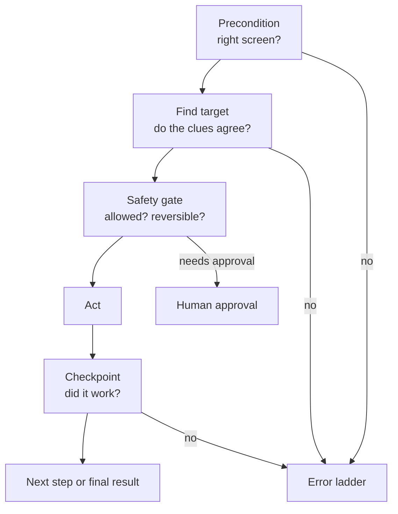

### What the caller gets back

| Status | Final | Meaning |
|---|---|---|
| `success` | Yes | Done. Outputs included |
| `business_outcome` | Yes | A real answer, not a crash. Example: `member_not_found` |
| `failed` | Yes | Hard failure during the run. Includes step, expected state, observed state, evidence links |
| `rejected` | Yes | The request broke a rule. Nothing ran. The caller fixes the request, not retries |
| `running` | No | Automation is working, including after a human hands back |
| `escalated` | No | A human is needed or working. Poll by run ID |

- **Every result also carries:** artifact version, patch revision, recoveries used, human interventions, duration.
- **An `effect` block says whether data changed.** Its `commit` state is one of six: `not_sent`, `refused`, `confirmed`, `uncertain`, `found_by_check`, `absent_by_check`.
- **`uncertain` (the old `effect_uncertain`):** only when the irreversible action was sent, then something failed. The reconciliation check finds out what happened.
- **`safe_to_retry` is `false`** for `confirmed`, `found_by_check`, and `uncertain`.
- **Callers read leniently.** Unknown outcome code: generic business outcome. Unknown failure code: generic failure. Unknown warning or field: ignore.
- **Statuses and commit states are fixed for format 1.** New ones need format 2.
- **Bad inputs are rejected before the run starts.** No browser opens. Status `rejected`, code `invalid_input`.

### What the caller sends

- **The capability, by major version:** `sparrow-core/open_savings_subaccount@1`. The resolver picks minor, patch version, and tenant patch.
- **Tenant is not a caller field.** The entry point adds `caller: { tenant, agent_id }` from credentials. A changed request field must never reach another bank.
- **App version comes from bank settings.** Tenant plus app version gives the context.
- **Full request fields:** section 3 §4.

### Irreversible steps in replay

- **The calling agent sends an authorization** with the request. It already got consent from the member or staff.
- **No authorization means pause for a human.** A bank can force human approval always.
- **The caller also sends a mode:**
  - `supervised`: an operator confirms the run before it starts. Escalations go to that operator.
  - `unattended`: the run starts at once. It still escalates when stuck.
- **Unattended on an unapproved context:** rejected with `context_not_approved`. Never a silent downgrade.
- **Unattended when the reconciliation check is not approved:** rejected with `reconciliation_not_approved`.

---

## 8. When things go wrong: the error ladder

> **In one line:** try the cheapest helper first. Climb only when it cannot answer.

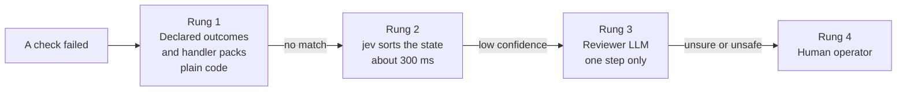

### Every rung ends in one of three results

- **Business outcome** — return it to the caller.
- **Recovered** — continue by the resume rule. Section 5 §8.6.
- **Hard failure** — stop, with evidence.

### jev's job, exactly

- **jev sorts. It never invents an action.**
- **It picks from installed handlers and fixed buckets:** `outcome`, `handler`, `needs_review`, `unsafe`.
- **Low confidence counts as "needs review."** Its probability decides when to climb.
- **The reviewer LLM gets one step.** Its one action still passes the safety gate.
- **Rungs 2 and 3 are skipped while the helper window is closed.** A bank may switch them off.

### Four example cases

| What happened | Caught at | Result |
|---|---|---|
| Member does not exist | Rung 1, declared outcome | `business_outcome: member_not_found` |
| Session timed out | Rung 1, timeout handler | Handler runs `sign_in`: the session capability signs in again. The resume rule continues. `success` with one recovery |
| Unknown popup | Rung 2 then 3 | Reviewer clicks Close. `success`, flagged for a new handler |
| Supervisor code needed | Rung 1 says "needs human" | Human types code in the same browser. `success` with one intervention |

---

## 9. Handler packs: skills for replay

> **In one line:** "if you see X, do Y" rules, installed per app, like skills for an agent.

### Key difference from LLM skills

- **LLM skills are picked by a model.** That is judgment.
- **Handlers are picked by a plain-code detector.** That is a match. Replay stays model-free.

### One handler

- **A pack holds its own targets and conditions,** in the artifact formats. Handlers cannot use artifact targets.
- **Detector:** a condition that proves the state. Same condition language as artifacts. Detectors are conditions only: no step IDs. Location limits sit inside the condition.
- **Class:** business outcome, recoverable, hard failure, or needs human. A `business_outcome` handler returns only codes the current step declares. Else: failed, `undeclared_outcome`.
- **Response:** a fixed list of actions. Only `recoverable` handlers act. Their actions carry human-confirmed `idempotent` or `reversible` flags.
- **Limits:** max attempts. Runs only if the current step is safe to retry.
- **Fixtures:** at least one `fire` and one `no_fire` per handler, plus a shared negative library.
- **Approval sits in the pack file,** like policy. Not per context.

### Scope: most specific wins

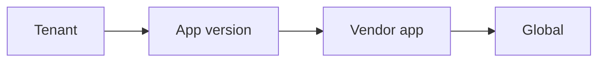

- **Checked left to right.** A bank can override or switch off any inherited handler.
- **The handler set is frozen at run start** and logged. Same run, same rules.
- **Two handlers match:** most specific scope, then priority, then jev decides.

### Where handlers come from

- **Written by hand** for known states.
- **Learned from human fixes.** The screen becomes the detector. The human's actions become the response.
- **Always start as drafts.** A reviewer approves them and picks the scope.
- **New handlers start at tenant scope.** Wider scopes need fixtures from two tenants or two apps.

---

## 10. Human handoff

> **In one line:** one driver at a time, the same browser, and the bot re-checks before it takes back control.

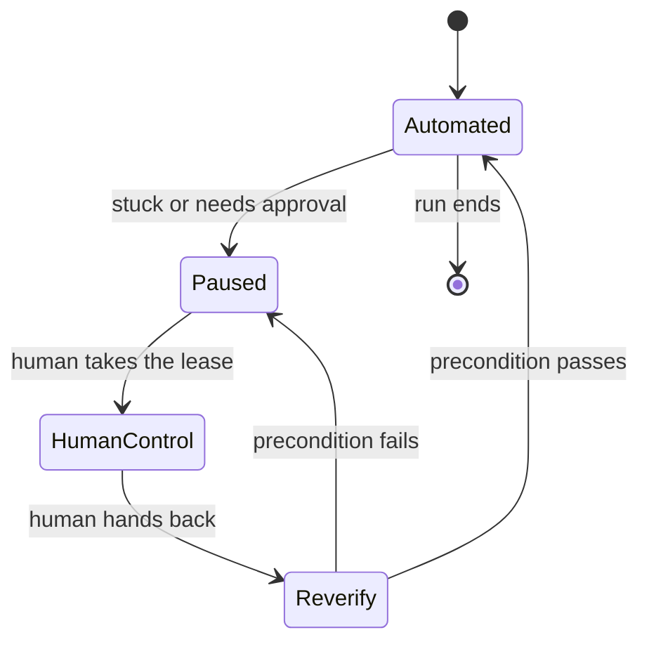

### Approval versus takeover

| | Approval | Takeover |
|---|---|---|
| When | A risky click needs a yes | The bot cannot continue |
| Who holds the lease | Bot, frozen | Human |
| Cost | Seconds | Minutes |

- **Lease values:** `bot`, `human`, `nobody`. Approvals keep the lease with the bot, marked `waiting`.

### How it works in the build

- **The browser runs visibly.** The operator uses that same window. Same cookies, same session.
- **The request carries context:** task, step, redacted screenshot, reason.
- **Human clicks and typing are recorded,** through the same redaction.
- **Bot actions are refused** while the lease is not "bot".
- **Human input while the bot drives pauses the run.** Takeover reason `unexpected_human_input`.
- **Watchers check the commit step's checkpoint** while a human drives.
- **Reverify searches forward** for steps the human finished, then falls back to the resume rule.
- **The build's operator surface:** the visible browser, the CLI, and a file mailbox. No server.
- **The operator works from a second terminal:** `operator list`, `claim`, `release`, `decide`, `dialog`.
- **The mailbox lives inside the run folder,** one subfolder per intervention. It is evidence.
- **Claims use exclusive file creation.** Two operators can never both claim.
- **Designed only:** a remote web console that streams the same session.

---

## 11. Safety

> **In one line:** one gate, no exceptions, nothing sensitive written down.

| Guardrail | What it does |
|---|---|
| Policy layers | Global, app, tenant. A lower layer only tightens. A loosening file fails to load |
| Allowlist | Hosts from bank settings × paths from policy × action types. Deny by default |
| Two locks | The action gate checks before acting. The network guard checks where the browser goes |
| Unsure rule | An unknown button label counts as irreversible |
| Live re-check | Replay blocks a click if the control's words changed to riskier ones |
| Bank opt-in | A bank lists each capability it allows |
| Risk flags | Each step is idempotent, reversible, or irreversible |
| Irreversible rule | Never auto-retried. Needs authorization or a human yes |
| Secrets by reference | Artifacts and prompts hold names, not values. Bank settings supply values. Callers never name secrets |
| Secrets in `type` only | A secret may only fill a whole value in a typing step. Conditions on a secret-filled field may only test "not empty" |
| Paths, not addresses | Artifacts hold paths. Bank settings supply each bank's address |
| Redaction at write time | Logs, evidence, screenshots, and image crops are masked before saving |
| Input crops before typing | Image crops of input boxes are taken before typing, so no member data lands in them |
| Session cookies | Never saved to disk |
| Known input values in logs | Replaced with `{input.name}` at write time. Secrets appear only as `{secret.name}` |
| Sensitive outputs | Raw only in memory, for a delivery window (default 15 minutes). Stored results mask them, with warning `outputs_masked` |
| Playwright traces, HAR files, cookies, storage state | Never saved in evidence. A dev-only flag may write traces to a git-ignored folder, against the local bank app only |
| Evidence per tenant | `evidence/<tenant>/runs/<run_id>/`. Evidence levels: `minimal`, `standard` (default), `full` |
| LLM view | Masked, like the logs. The LLM types references, never values |
| Masked values only | Models and the evidence store accept masked values only. A raw value fails to compile |
| Inputs off the command line | Input values never go on the command line. Only files or standard input |
| Video recordings | Never saved in evidence |
| Retention | Audit files for runs where data changed or is unknown: 5 years. Other runs: 1 year. Debug files: 30 days |

### Known limits

- **Bland labels are caught as unsure in discovery.** A reviewer can still lower a flag wrongly.
- **Names inside free sentences can slip past redaction.** Labelled names are caught.
- **Screenshots sent to the LLM are masked.** Resolved; no longer a limit.
- **The build trusts the caller's authorization.** Signed tokens are designed in section 4 §11.

---

## 12. Seeing the screen

> **In one line:** record many clues per target. Act only when the clues agree.

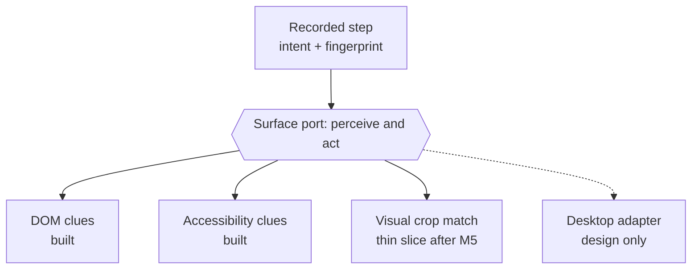

### Rules

- **Role filters first.** A recorded button never matches a link.
- **Role groups, not exact roles.** A stripped button stays button-like.
- **Clues vote.** A clear winner means act. A tie or no match goes to the error ladder.
- **Missing clues leave the vote. Different clues vote against.**
- **Winner:** score 0.70 or more, and a lead of 0.15. Evidence at least 0.20, with a name, label, text, or picture agreeing.
- **Checks answer true, false, or unknown. Only true passes.**
- **Weights and thresholds live in the replay engine,** not the artifact. Each run logs the engine version.
- **The visual match is plain code, not a model.** Replay stays deterministic.
- **Fixed viewport and pixel density** keep screenshots identical between runs.
- **Demo idea:** a bank app flag strips one button's text. DOM clues fail, the visual match passes.

---

## 13. Confidence, approval, and drift

> **In one line:** test before trusting, keep testing after, and only humans restore trust.

- **Machines may take trust away. Only humans give it.**
- **A full batch runs baseline, matrix, extra cases, drills, and stability.** Example: 72 runs for the savings sub-account capability.
- **Every run is judged against truth:** the fault log and the oracle. Never the run's own report.
- **The gate:** zero `wrong`; baseline, matrix, and extra cases all `pass`; nothing left `void`. Stability has no rate floor.
- **Two scores:** outcome score and lowest margin. Fragile steps need a written note at approval. They do not block.
- **Stability:** a curve at entropy 0.05, 0.15, and 0.30. Twin runs measure flakiness.
- **Tuned timeouts:** a batch proposes candidates. The next batch tests them. Approval installs only tested values.
- **The key has four parts.** Engine version and handler set hash stay out. Approval checks they are fresh.
- **Live score:** clean ÷ counted, last 50 runs. App failures do not count.
- **Two demotion rules:** below 0.90 over 20 or more runs; or 3 recipe failures in a row at one step.
- **The drift reader** ties drops to pack, engine, or jev changes. It drafts tenant patches (stretch).

### Example

- **Day 1:** a 72-run batch at bank A. Zero `wrong`. One fragile step, acknowledged. Approved.
- **Week 2:** bank B certifies the same version. One label differs. A patch draft, sealed, certified, approved.
- **Month 3:** app 9.3 ships. The streak rule degrades the key at two banks. A new version for 9.3.

---

## 14. Many banks, many surfaces

> **In one line:** new surface = new adapter. New bank = small override. No re-recording.

- **Legacy web:** same Playwright adapter. Fingerprints do not need test IDs or clean markup.
- **Desktop:** a new surface adapter over OS accessibility trees. Design only.
- **No DOM at all:** the visual clue carries the vote. Full vision discovery is design only.
- **Many tenants:** base artifact per vendor app, plus small per-tenant patches.
- **One tenant patch on the session capability** fixes login differences for every capability of that bank.
- **Patches change target clues and condition values only.** Never the contract, steps, or recovery.
- **An extra screen at one bank is structural.** That bank gets its own artifact version, for now.
- **Artifacts hold paths, not bank addresses.** The same file serves every bank.
- **Shared fixes:** handler packs at vendor scope help every tenant at once.
- **Drift:** per-context scores show who broke and why.

---

## 15. Tech stack

| Area | Choice | Why |
|---|---|---|
| Language | TypeScript on Node.js | Playwright is Node-first; jev has strong TypeScript support |
| Browser | Playwright, as a library | Auto-waiting, role and label locators, accessibility snapshots, visible mode |
| Schemas | Zod, exported to JSON Schema | Validation, types, and an agent-readable contract from one source |
| Discovery LLM | Claude Sonnet 5, tool use with images | Strong UI reasoning; tool calls map to our actions |
| Error sorter | jev | Typed answer plus probability, fast, cheap |
| Reviewer LLM | Claude Sonnet 5, one-step prompt | Rarely runs; needs vision and judgment |
| Storage | JSON, JSONL, PNG files | Reviewed files (the library) live in git; runtime files (the state) do not; chosen evidence is published into `/evidence/`. Hundreds of dev runs and thousands of live lines would bury the reviewer |
| Tests | Vitest, plus Playwright on the local bank app | Fast unit tests, real integration tests |
| Secrets | Environment variables, bound explicitly per bank and app in the settings file. Convention: `INTYY_<TENANT>_<APP>_<NAME>` | Never in artifacts, logs, or prompts |

### Rejected

- **Playwright MCP:** built for models calling tools. Wrong layer for replay.
- **cua in the build:** VM infrastructure is overkill for one web app.
- **A database or queue:** nothing needs one yet. The brief warns against it.
- **Python:** equally valid. We chose TypeScript. Locked.

---

## 16. How we verify it

> **In one line:** test all plain code in CI without models. Measure models separately.

| Layer | What it proves | In CI? |
|---|---|---|
| Contract tests | Every artifact, tenant patch, handler pack, and policy matches its schema and passes loader checks | Yes |
| Unit tests | Target finding, safety rules, redaction, handler scope, lease rules | Yes |
| Recorder golden test | A saved, redacted discovery log always produces the same artifact | Yes |
| Replay fault matrix | Each fault gives the right result class | Yes, jev and reviewer faked |
| Safety tests | Secret canary and member canary never saved; outside links, redirects, and human jumps blocked; unsure and irreversible clicks pause; a loosening policy fails to load | Yes |
| Handoff test | A scripted "human" takes over, acts, and hands back | Yes |
| Determinism test | Same inputs, same step trace, every time | Yes |
| Fixture suite | Every detector fires on its trouble screens and on no normal screen, per pack and per merged set | Yes |
| Ladder matrix | Helper window, resume rule, rung order, and every bank app fault in section 5 §14 | Yes, jev and reviewer faked |
| Score store golden test | Same logs give the same record bytes | Yes |
| Harness boundary | No replay-path module reaches the harness port | Yes |
| Certify quick batch | A `quick` batch passes on the local bank app | Yes, jev and reviewer faked |
| Port contract suites | Real adapters and fake twins behave the same | Yes |
| Structure checks | Only the gate holds hands; raw values cannot reach models or logs | Yes |
| CLI rules | Exit codes, output rules, roles, four eyes, `--expect-record`, locks | Yes |
| Model evaluations | Discovery success rate; jev accuracy and threshold | No, run on demand |
| Full certify batch | A real batch on bank A, with real models | No. On demand, once for `/evidence/` |

### Brief requirement to proof

| Requirement | Proof |
|---|---|
| 3.1 Agent loop | Real discovery run log and screenshots |
| 3.2 Artifact | Saved artifact plus schema tests |
| 3.3 Replay and errors | Replay logs: success, not found, timeout |
| 3.4 Safety | Test report plus blocked-action log |
| 3.5 Evidence | Failure screenshot and DOM snapshot |
| 3.6 Handoff | Handoff run log with lease events |
| 3.7 Heterogeneity | Ports with fake adapters, plus REPORT section |
| 8 Confidence and approval | The batch report and the approval history |
| 8 Multi-run stability | The batch report and the approval history |

---

## 17. Build plan

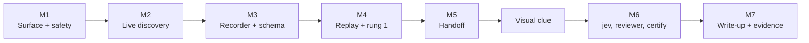

- **Each milestone has a test gate.** No gate, no next step.
- **The full thin slice exists by M5.** Later work adds depth, not missing pieces.
- **Must-haves from the brief:** a real LLM run in `/evidence/`, `README.md`, `REPORT.md` with seven headings, and one replay that hits an error.

---

## 18. Built, designed, or cut

| Item | Status | Why |
|---|---|---|
| Discovery, recorder, replay, ladder, handoff, safety | Built | Core requirements |
| Handler packs and certify | Built | Make replay robust and trustworthy |
| Visual crop clue | Built, thin | Brief favors surviving with no clean DOM |
| Tenant patches | Format designed; build is stretch | Cheap with files; listed stretch goal |
| Score store, certify runner, scorer, gate, approval, resolver | Built | The "confidence and approval" goal |
| Stability curve and twin runs | Built | The "multi-run stability" goal |
| Four eyes at approval; second look at sealing | Built | Small, and banks expect it |
| Reconciliation autonomy evidence; major records; pack regression; drift reader | Built, thin | Mechanism real; depth needs more data |
| Patch drafting and the bank B drill | Stretch | The cross-tenant goal. Section 10 decides |
| jev threshold calibration; tag autonomy | Designed; reports built | Too few samples in one take-home |
| Clue weight calibration; sampled regression at scale | Designed | Engine-wide, or needs many tenants |
| Full operator console | Designed | Brief allows a bare console |
| Vision-driven discovery | Designed | Heavy; DOM discovery works on our app |
| Desktop adapter | Designed | Brief does not expect it |
| Database, queues, clusters | Cut | Brief warns against scaling infrastructure |

---

## 19. Decisions locked after v0

> **In one line:** we cannot undo an irreversible step, so we find out what happened, then move forward.

### Commit points

- **Each capability has at most one irreversible step:** its commit point.
- **Before it:** any failure is safe. Start over.
- **After it:** forward only. Never retry. Never restart.
- **Two irreversible steps means two capabilities.**
- **Write-ahead rule: no log, no commit.** Write a `commit_intent` log line and force it to disk before sending the action.
- **If that write fails,** the action is never sent. The run fails with `evidence_write_failed`.
- **If intyy crashes after the intent line,** the commit state is `uncertain`.
- **An outcome on the commit step means the app refused.** Result: `business_outcome`, commit `refused`. A human confirms each such outcome means "no change."
- **A human may click the commit button during a takeover.** The effect block then records `performed_by: human`.
- **Only plain code may say "nothing changed."** jev and the reviewer never claim `refused`.
- **Helpers never act while the commit is in flight.** The bank app's pop-up buttons re-send the original request.
- **Every takeover opened while the commit is in flight** shows: "The commit action was already sent. Do not submit again."
- **Reconciliation runs in a fresh browser session,** as a child run.
- **A blocked click on Confirm is `not_sent`,** when the browser proves no input went out.
- **A commit retry is a new child run with a new run ID.** One commit per run stays true.
- **Outputs lost after a confirmed commit** are fetched by the reconciliation check.

### When the commit step fails

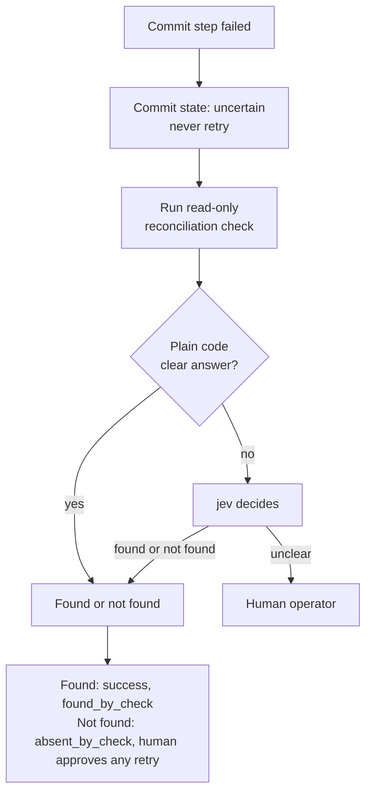

### Reconciliation rules

- **Mandatory** for every artifact with a commit point.
- **Written waiver** only when the app has no screen to read the result. Every failed commit then goes to a human.
- **Correlation reference:** write a unique run ID into a notes field, where policy allows. Makes matching exact.
- **Compensation, not rollback:** `compensated_by` links an undo capability. It always needs human approval.

### jev autonomy for reconciliation

- **Plain code decides first.** jev runs only when code is unsure.
- **Trust is earned in certify, against known truth:** 20 correct cases, with 5 or more `found` and 5 or more `not_found`, and zero `wrong`. Certify drills only.
- **Before autonomy:** an LLM reviews every jev decision. Disagreement goes to a human.
- **After autonomy:** the LLM spot-checks about 1 in 20.
- **Scope:** the parent key, the check key, and the jev version.
- **jev decides the answer, never the action.** Retries and compensation always need a human yes.
- **A human grants autonomy.** A spot-check disagreement, a human override, or a certify `wrong` revokes it. Evidence resets.
- **Why:** a jev that always says `found` could earn 20 on found cases alone. A new check or jev version is new behavior.

### LLM tags, humans decide

- **Discovery tags every action:** flow step, incidental, correction, or exploration.
- **Humans accept or change each tag.** Autonomy is earned per tag type, from agreement data.
- **The agreement table is built.** Granting tag autonomy is designed only.
- **Never pre-filled** on the commit point, on gated actions, or on human actions.
- **Risk flags always need a human.**

### Language

- **TypeScript, strict mode, current Node.js LTS.**
- **Heavy documentation:** file headers, doc comments on every export, "why" comments, and `docs/typescript-refresher.md`.

### Fault injection

- **Three places:** bank app switches, network faults through Playwright, and page injection.
- **Named fault profiles:** scheduled, or seeded when random.
- **Test targets only.** Every injected fault is labelled in evidence.
- **Star case:** "commit reply lost" proves the reconciliation path on demand.

### Chaos server decisions

- **Wait for state, not time.** Wait until the checkpoint is true, up to a timeout.
- **Per-step timeouts:** candidate, then approved.
- **Retries stay limited to idempotent steps.** The chaos server does not change that.
- **intyy's own network faults** are mostly redundant for this app. Keep them for apps we do not control.

---

## 20. Next: the bank app contract

- **A separate agent builds the bank app.** intyy depends only on a written contract.
- **intyy's code never hardcodes knowledge of the bank app's screens.** Just like a real vendor app.
- **Look and behavior:** a 2008-era Indian retail bank app. Slow, with random errors.
- **Chaos server:** sits in front of the bank app. An entropy value from 0 to 1 sets the error rate.
- **intyy's requirements on it:** seeded and reproducible, blocks before and after the endpoint, keeps a fault log, supports named faults.
- **Handoff brief:** `bank-app-handoff.md`.

---

## 21. Changes from section 2

> **In one line:** section 2 designed the artifact field by field. These points change or extend this doc.

### Artifact shape

- **Ten blocks,** not three. See section 6.
- **Fingerprints live once, in `targets`.** Screen checks live once, in `conditions`.
- **Steps refer to targets and conditions by name.** Never inline.
- **Step IDs are stable names.** Tenant patches depend on them.

### Identity and versions

- **Identity is app + capability + version.** Tenant and app version range are not part of it.
- **Callers name a major version:** `app/capability@major`. The resolver picks minor, patch version, and tenant patch. Changed by section 3; see section 23.
- **Semver tracks what the caller sees.** Major breaks callers. Minor adds safely. Patch changes only the recipe.
- **Sealed artifacts never change.** The content hash lives in the store index.

### Who writes it

- **The recorder writes it, as plain code.** Only observed facts go in.
- **Candidate, then sealed.** Human review happens before the file freezes.
- **Negative discovery runs** capture business outcomes.

### Moved out of the artifact

- **Approval state:** to the score store, per context.
- **Tuned timeouts:** to the score store, per context. The artifact keeps a default.
- **Clue weights:** to the replay engine.
- **Required secrets:** derived from the steps, not stored.

### Commit points

- **`recovery` holds:** commit point, reconciliation check or waiver, and `compensated_by`.
- **The reconciliation check is a separate read-only capability,** linked by major version.
- **If that check is not approved in a context,** the commit capability cannot run unattended there.

### Tenant patches

- **One active patch per bank per capability.** Numbered by revision.
- **Approval covers base version plus patch revision.**
- **Replay drafts patches from clue disagreements.** A human seals them. Replay never edits itself.

---

## 22. Design plan

> **In one line:** one section per chat, in dependency order.

| # | Section | Covers | Status |
|---|---|---|---|
| 1 | Component design | This doc | Done |
| 2 | Artifact schema | All artifact fields; tenant patch format | Done |
| 3 | Run outputs | Invocation request, result contract, run log, evidence layout | Done |
| 4 | Safety policy | Policy file, allowlist, risk rules, secret binding and injection, redaction | Done |
| 5 | Handler packs and error ladder | Handler format; jev input and output, including reconciliation; reviewer limits; learned handlers | Done |
| 6 | Discovery and recorder | Observation format, LLM prompt, action tools, tag set, recorder rules | Done |
| 7 | Replay engine and handoff | Wait rules, clue voting, retries, control lease, intervention request | Done |
| 8 | Trust and versions | Score store, certify, fault profiles, autonomy records, resolver | Done |
| 9 | Interfaces | Ports, stores and file locations, CLI commands, review and approval flows, locks | Done |
| 10 | Claude Code handoff | Repo layout, milestone specs, `CLAUDE.md`, README and REPORT outlines | Next |

- **Section 10 needs the bank app's `CONTRACT.md`.** Sections 5 and 8 benefit from it too.
- **Each chat ends with** a decision doc and a handoff doc for the next.
---

## 23. Changes from section 3

> **In one line:** section 3 designed the request, result, log, and evidence. These points change or extend this doc. The sections above already reflect them.

### Contract changes

- **Callers name a major version:** `app/capability@major`. Was: a bare name. See sections 7 and 21.
- **Six statuses, not four:** `rejected` and `running` added. See section 7.
- **`effect_uncertain` became a commit state.** An `effect` block with six states replaces the flag. See sections 7 and 19.
- **"Reconciliation found it" is `found_by_check`,** not a warning. Say each fact once.
- **Forward-compatibility rules** now cover failure codes, warnings, and fields, not just outcomes.

### New rules

- **Tenant from caller identity; app version from bank settings.** See section 7.
- **Write-ahead rule for the commit action:** no log, no commit. See section 19.
- **Commit-step outcomes mean "the app refused."** A human confirms each one. See section 19.
- **Logs replace known input values with references.** The recorder reads the redacted log alone. See sections 5 and 16.
- **Raw sensitive outputs stay in memory only,** for a delivery window. See section 11.
- **Mode meanings defined;** no silent downgrade to supervised. See sections 6 and 7.
- **Evidence splits by tenant; Playwright traces and HAR files banned.** See sections 4 and 11.

### Changes to section 2 (applied there)

- **Run ID format:** `run_` + date + `_` + 10 Crockford base32 characters. Example: `run_2026-09-24_7kq2m9x4tb`.
- **More frozen facts per run:** policy version and hash, app version, evidence level.
- **Provenance run kinds gain `certify`.** New decision kind `refusal`, with a loader check.

---

## 24. Changes from section 4

> **In one line:** section 4 designed the gate, secrets, and redaction. These points change or extend this doc. The sections above already reflect them.

### Changes to this doc

- **Policy is three layers,** global, app, and tenant. Lower layers only tighten. See section 11.
- **Bank settings is a real file,** `intyy.settings/1.0`, frozen per run. See sections 3 and 15.
- **A network guard is the second lock** behind the action gate. Not a bypass. See section 11.
- **The LLM sees the masked view and types references.** It never sees input values. See sections 5 and 11.
- **Discovery runs on test environments by default.** Approvals carry a risk hint. See section 5.
- **Capabilities are opt-in per bank.** See section 11.
- **Video recordings are banned from evidence.** See section 11.
- **Retention:** data-changing runs keep audit files 5 years. See section 11.
- **New failure code `secret_unavailable`:** a required secret has no value. No browser opens.

### Changes to sections 2 and 3 (applied there)

- **New artifact field `runs_on.paths`.** In paths, `*` never crosses `/`.
- **Secret-filled fields:** conditions may only test "not empty."
- **Mask formats are final:** references, per-run tokens, and `[pii]` / `[financial]` placeholders.
- **Frozen facts:** `policy` lists three layer revisions; `settings` is frozen too.
- **New codes:** `policy_denied` reasons, approval reason `discovery_irreversible`, gate decision `observed`, a fixed rule ID list.

---

## 25. Changes from sections 5 to 7

> **In one line:** sections 5 to 7 designed handler packs, discovery, and replay. The sections above already reflect the changes.

### From section 5

- **New words:** helper window, resume rule, pre-commit sweep, fixture, draft handler. See section 3.
- **The error ladder:** "Recovered" now means continue by the resume rule; jev's buckets are renamed `outcome`, `handler`, `needs_review`, `unsafe`; rungs 2 and 3 skip while the helper window is closed. See section 8.
- **Handler packs gain rules:** their own targets and conditions, detector scope, `business_outcome` limits, recoverable-only actions, scope-then-priority-then-jev matching, pack-level approval, fixture pairs, and tenant-first scope for new handlers. See section 9.
- **Verification gains a fixture suite and a ladder matrix.** See section 16.
- **Commit points:** only plain code says "nothing changed"; helpers never act mid-commit; a takeover mid-commit warns against re-submitting. See section 19.
- **Section 5 is marked Done** in the design plan. See section 22.

### From section 6

- **New words:** session capability, prelude, run spec. See section 3.
- **Discovery rules:** signing in is its own capability (the prelude); the LLM sees a marked screenshot; no handlers run during discovery; the operator declares inputs, outputs, and expected effect. See section 5.
- **Recorder rules:** preconditions also check every fill on the screen; checkpoints must flip false-to-true; the candidate regenerates after each review decision. See section 5.
- **One tenant patch on the session capability** fixes login differences for every capability of that bank. See section 14.
- **Section 6 is marked Done** in the design plan. See section 22.

### From section 7

- **New words:** watcher, reverify, mailbox. See section 3.
- **Human handoff:** lease values `bot`/`human`/`nobody`; human input mid-run forces a takeover; watchers check the commit checkpoint; reverify searches forward before falling back to the resume rule; the operator surface is the browser, the CLI, and a file mailbox. See section 10.
- **Seeing the screen:** role groups, not exact roles; missing versus different clues; a winner needs a 0.70 score with a 0.15 lead and a 0.20 evidence floor; checks return true, false, or unknown. See section 12.
- **Commit points:** reconciliation runs as a fresh child session; a blocked Confirm click is `not_sent`; a commit retry is a new child run; outputs lost after a confirmed commit are fetched by reconciliation. See section 19.
- **Section 7 is marked Done, section 8 is marked Next** in the design plan. See section 22.

### Changes to section 2 (applied there)

- **New `runs_on.session` field:** a session capability link, or `null`. With a link, `entry` is the first task page, after the prelude.
- **`type`, `read`, and `field_value` gain an optional `format` field.** A `read` step for a `date` output requires one.
- **Clue voting is now exact:** a 0.20 evidence floor, a 0.70 win score, and a 0.15 lead. Conditions resolve to true, false, or unknown.
- **Loader checks added:** the session link, formats, and a candidate-mode allowance for a `recovery` placeholder with no capability.
- **Parked items resolved:** handler detectors' shared condition language, jev's reconciliation input and output, the discovery observation format, recorder rules, and whether login steps are shared (a session capability).

---

## 26. Changes from section 8

> **In one line:** section 8 designed trust and versions. The sections above already reflect the changes.

- **New words for keys, batches, verdicts, the gate, fragile steps, the harness, and live scores.** See section 3.
- **The core gains a harness port, a certify runner, a scorer, and a drift reader,** plus new store files: suites, test data sets, fault profile sets, threshold records, major records, alerts. See section 4.
- **One approved key per context and major.** Degraded blocks unattended runs; a human restores a degraded key or reinstates a retired one; no automatic fallback. See section 6.
- **Confidence, approval, and drift rewritten:** the gate, two scores, the stability curve, tuned timeouts, live score, and the two demotion rules. See section 13.
- **Verification gains a score store golden test, a harness boundary check, and certify batches.** See section 16.
- **New built and designed items:** score store, certify runner, scorer, resolver; stability curve; four eyes and second look; drift reader; patch drafting and the bank B drill as stretch. See section 18.
- **jev autonomy for reconciliation scoped to the parent key, check key, and jev version, with a stricter readiness bar;** the tag agreement table is built; chaos server timeouts become candidate then approved. See section 19.
- **Section 8 marked Done** in the design plan. See section 22.

### Changes to other sections (applied there)

- **Section 2:** major deprecation dates move to a major record; the approval key gains the patch revision; one active patch per approved key; timeouts split into `approved` and `candidate`; a `risk_second_look` decision.
- **Section 3:** new pre-run checks and rejection reasons for degraded and unapproved contexts; certify run spec fields; masked observed values on differing clues; batch folders under evidence.
- **Section 4:** certify runs only where settings say `environment: test`; the bank app's harness path is denied to the browser; lowering a risk flag needs a second reviewer, built at sealing.
- **Section 5:** pack approval needs a passing regression batch; jev thresholds live per app and jev version, with context-only tightening; reconciliation autonomy records live in the score store.
- **Section 6:** certify timeouts share the tuning floors; sealing gains the second-look rule; the tag agreement table feeds autonomy.
- **Section 7:** the resolver freezes approval state and timeout source; certify judges reconciliation against the oracle; the operator port gains a scripted twin for certify.

---

## 27. Changes from section 9

> **In one line:** section 9 designed ports, file locations, CLI commands, and locks. The sections above already reflect the changes.

- **New words:** fake twin, eyes and hands, masked value, library, state, publish. See section 3.
- **Ports become the full list** (surface, planner, classifier, reviewer, operator, harness, secrets, clock and IDs, four store shapes, locks); the gate alone holds the hands; the CLI is one `intyy` binary with top-level verbs for browser commands and noun-then-verb for the rest. See section 4.
- **Human handoff gains a second-terminal operator CLI** (`list`, `claim`, `release`, `decide`, `dialog`), a mailbox inside the run folder, and exclusive claims. See section 10.
- **Safety adds:** models and the evidence store accept masked values only; input values never go on the command line. See section 11.
- **Storage splits into library (git) and state (not git);** chosen evidence is published into `/evidence/`. See section 15.
- **Verification gains port contract suites, structure checks, and CLI rules.** See section 16.
- **Section 9 marked Done, section 10 marked Next** in the design plan. See section 22.

### Changes to other sections (applied there)

- **Section 2:** each store folder gets its own `index.jsonl`; a candidate changes only through recorded decisions; a second reviewer's disagreement records a `risk` decision of `irreversible`.
- **Section 3:** the request index lives under `state/var/`; the CLI hosts a replay until it ends and `run status` polls the stored result; a `model_unavailable` failure code; a manual `intyy reconcile` command.
- **Section 4:** the seal hash excludes the `approved` block; `--reveal-outputs` needs a test environment and a loopback origin; staff roles live in a reviewed `library/staff.json`.
- **Section 5:** candidate pack revisions and fixture file locations; `pack impact` and `pack approve` check regression coverage.
- **Section 6:** run spec and candidate file locations move under `library/`; a model failing twice ends a run `failed`.
- **Section 7:** implicit claims need a staff ID; mailbox and lock file locations fixed; `run sweep` and `reconcile` commands.
- **Section 8:** the trust store moves to `state/trust/`, outside git; batch kinds gain `certify case`, `certify rerun`, and drills; giving trust needs an approver, taking it away needs an operator or approver; approvals quote the record hash they read.
