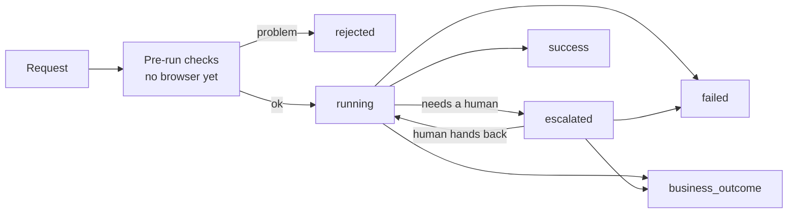
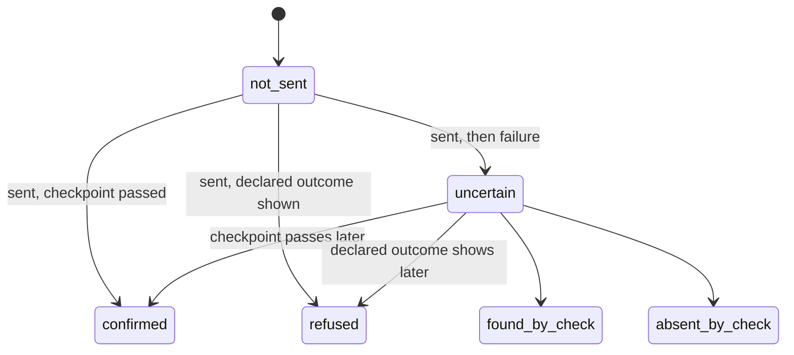

# intyy — Section 3: run outputs

> **Status:** complete, 24 Sep 2026.
> **Formats defined:** `intyy.request/1.0`, `intyy.result/1.0`, `intyy.log/1.0`, `intyy.run/1.0`.
> **Depends on:** section 1 (component design) and section 2 (artifact schema).
> **Changes to earlier docs:** listed in `intyy-design-updates-from-section-3.md`.
> **Used by:** sections 4 to 10.
> **Amended by section 4,** 24 Sep 2026: settings format, policy rule IDs, new codes and reasons, final mask formats, retention. Formats are not yet released, so they are amended in place.
> **Amended by sections 5 to 7,** 25 Sep 2026: business outcome `decided_by`, new failure codes, effect transitions and `attempts`, recoveries via reconciliation, new log events and warning codes, run_start frozen facts (handler packs, models, ladder, session, discovery spec), linked run `purpose`, escalation reasons, rung-2 evidence capture. Formats are not yet released, so they are amended in place.
> **Amended by sections 8 and 9,** 25 Sep 2026: pre-run check and rejection reasons for degraded contexts, the deprecation warning scoped per context, the certify run spec and pin rules, masked differing-clue values, live fault sourcing, run_start `approval` and `timeouts_from`, the evidence root move to `state/evidence/` with published copies in `/evidence/`, batch folders, manual reconciliation and `effect_updated`, the request index location, the CLI's `wait_ms` mapping, and a new discovery failure code. Formats are not yet released, so they are amended in place.
> **File format:** JSON and JSONL. Zod defines each schema and exports JSON Schema.

---

## Contents

1. [Purpose](#1-purpose)
2. [Design principles](#2-design-principles)
3. [A run in one view](#3-a-run-in-one-view)
4. [Invocation request](#4-invocation-request)
5. [Result contract](#5-result-contract)
6. [Run log](#6-run-log)
7. [Evidence folder](#7-evidence-folder)
8. [How this meets the brief](#8-how-this-meets-the-brief)
9. [Rejected options](#9-rejected-options)
10. [Items parked for other sections](#10-items-parked-for-other-sections)
11. [Terms used in this section](#11-terms-used-in-this-section)

---

## 1. Purpose

- **This section designs everything a run takes in and gives out.**
- **Four formats:** the request a caller sends, the result it gets, the log of each run, and the folder that holds evidence.
- **The artifact is the promise. These formats are how the promise is kept and proven.**

### Readers and their needs

| Reader | Reads | Needs |
|---|---|---|
| Calling AI agent | Request, result | What to send, what came back, whether data changed, whether to retry |
| Operator | Result, log, evidence | What went wrong, where, and what a human did |
| Recorder | Discovery log | Every action with its target fingerprint, in order |
| Auditor | Log, run summary | Who did what, under which rules, with which authorization |
| Section 8 (trust) | Replay logs | Clue disagreements, recoveries, and outcomes per context |

---

## 2. Design principles

### 2.1 Nothing happened is different from something broke

- **A rejected request never opened a browser.** It gets its own status.
- **A business outcome is an answer.** A failure is a problem. They never share a status.

### 2.2 The caller always learns whether data changed

- **Every result of a `commits` capability carries an `effect` block.**
- **It says whether the irreversible action went out, and what is known about its result.**
- **Example:** the account opened, but reading its number failed. The caller must know both facts.

### 2.3 Strict on input, lenient on output

- **intyy rejects anything unknown in a request.** A typo must not pass silently.
- **Callers ignore anything unknown in a result.** New fields and codes then never break them.

### 2.4 Redact when writing, not later

- **Every log line and every file passes the redactor before it touches disk.**
- **Known input values become references.** Example: `100107` becomes `{input.member_id}` in the log.
- **Section 4 decides mask formats.** This section decides where redaction happens.

### 2.5 One ID links everything

- **The run ID appears in the result, the log, the evidence folder, the artifact's provenance, and the bank app's notes field.**
- **One search finds every trace of a run.**

---

## 3. A run in one view



- **Final statuses:** `success`, `business_outcome`, `failed`, `rejected`. They never change.
- **Non-final statuses:** `running`, `escalated`. The caller polls until the status is final.

---

## 4. Invocation request

**Job:** tell intyy which capability to run, with which inputs, and under what permission.

### 4.1 Fields

| Field | Required | Meaning | Example |
|---|---|---|---|
| `schema` | Yes | Request format version | `"intyy.request/1.0"` |
| `request_id` | Yes | The caller's own ID for this request | `"agt-teller-7f3c-0042"` |
| `capability` | Yes | App, capability, and major version | `"kvfcu/open_share_subaccount@1"` |
| `inputs` | Yes | Values for the contract's inputs | `{ "member_id": "100107" }` |
| `mode` | Yes | `supervised` or `unattended` | `"unattended"` |
| `authorization` | No | Proof of consent for the irreversible step | See 4.6 |
| `wait_ms` | No | How long to wait for a final result before returning | `30000` |

- **No tenant field.** See 4.2.
- **No version beyond the major.** See 4.3.
- **No test fields.** Fault profiles and seeds live in the internal run spec (4.9).

### 4.2 Tenant comes from the caller's identity

- **The entry point adds a `caller` block** after it checks the caller's credentials.
- **The entry point** is the front door of intyy: the CLI in the build, an API later.
- **The caller cannot choose a tenant.** A changed field must never let an agent act inside another bank.

```json
{ "caller": { "tenant": "keystone", "agent_id": "agent_teller_01" } }
```

- **In the build,** the CLI reads the caller block from a local config file. It stands in for real credentials.
- **App version comes from bank settings,** not from the caller. Tenant plus app version gives the context.
- **Bank settings have a format:** `intyy.settings/1.0`. It holds app addresses, app versions, and secret sources (section 4 §5).

### 4.3 The caller names a major version

- **Format:** `app/capability@major`. Same form as `recovery` links in section 2.
- **The resolver picks the minor version, patch version, and tenant patch.**
- **Why:** a major version breaks callers by definition. The caller's tool definition came from one major's contract.
- **Without the major,** a v2 rollout would silently break every v1 caller.
- **This changes section 2.** Callers invoked a bare name there. See the design update file.

### 4.4 Request ID and duplicates

**Request ID:** the caller's own name for one request. It is also an **idempotency key**: a key that makes a repeated request safe. Example: a network drop makes the agent resend. intyy must not open two accounts.

#### Rules

| Case | What intyy does |
|---|---|
| New request ID | Starts a new run |
| Same ID, same content | Returns the existing run's current result. Adds warning `duplicate_request` |
| Same ID, different content | Rejects with `request_id_reused`. Starts nothing |

- **Scope:** tenant plus agent ID plus request ID. Two agents may use the same ID safely.
- **Same content** means same capability, inputs, mode, and consent reference.
- **A repeat during a live run** returns its current status: `running` or `escalated`.
- **A new attempt after `failed` needs a new request ID.** A repeat returns the old failure, by design.

#### Format and storage

- **8 to 64 characters:** letters, digits, `-`, and `_`.
- **Must not contain member data.** intyy cannot fully enforce this. The docs for callers say so.
- **The request index stores a keyed hash of the content,** never the raw inputs.
- **Location:** `state/var/request-index/<tenant>.jsonl` (section 9 §6.3).
- **Keyed hash:** a fingerprint made with a secret key. Example: member IDs have few digits, so a plain hash is easy to reverse by guessing.
- **Keys expire after 7 days by default.** Each bank can change this.

#### Why the request ID is not the correlation reference

- **The run ID stays the correlation reference.** It is the value typed into the bank app's notes field.
- **intyy controls the run ID's length and characters.** Old notes fields reject odd input.
- **The caller controls the request ID.** It could hold data, or be too long.
- **One ID across notes, logs, evidence, and provenance** keeps matching simple.

### 4.5 Mode

| Mode | Meaning |
|---|---|
| `supervised` | An operator confirms the run before it starts. Escalations go to that operator |
| `unattended` | The run starts at once. Escalations go to the bank's operator queue |

#### Mode and approval

| Context state | `unattended` | `supervised` |
|---|---|---|
| Approved | Runs | Runs after start confirmation |
| Not approved | Rejected: `context_not_approved` | Runs after start confirmation |
| `commits`, reconciliation check not approved | Rejected: `reconciliation_not_approved` | Runs after start confirmation |

- **Never a silent downgrade to supervised.** The caller asked for no human at the start. A surprise wait breaks its plans.
- **Unattended still escalates when stuck.** Unattended means "no human at the start," not "no human ever."

### 4.6 Authorization

**Authorization:** proof that a member or staff member agreed to the irreversible step. The calling agent collects it. intyy checks it and logs it.

| Field | Required | Meaning | Example |
|---|---|---|---|
| `consent_ref` | Yes | Opaque ID of the consent record in the caller's system | `"consent_88121"` |
| `granted_by` | Yes | `member` or `staff` | `"member"` |
| `staff_id` | When `staff` | Staff member who gave or captured consent | `"op_031"` |
| `granted_at` | Yes | When consent was given | `"2026-09-24T10:14:00Z"` |
| `expires_at` | Yes | When consent stops being valid | `"2026-09-24T10:44:00Z"` |
| `capability` | Yes | Must equal the request's capability | `"kvfcu/open_share_subaccount@1"` |

#### Rules

- **Missing authorization never blocks the start.** The run pauses for human approval at the commit point.
- **Sent with a `read_only` capability:** rejected. It signals a confused caller.
- **Checked twice:** at the start, and again just before the commit action.
- **Expired at the commit point:** the run pauses for a human. It does not fail.
- **Lifetime limit:** 30 minutes by default. Set in policy: `authorization.max_lifetime_minutes`, global range 5 to 120.
- **Bank override:** tenant policy `approvals.force_human` can force human approval even with authorization. The authorization is still logged.
- **No member identity in this block.** The consent record holds the details. intyy holds the reference.

#### Known limit

- **The build trusts the caller's claim.** A real deployment needs a signed token over the request. Section 4 §11 designs it.
- **Future `authorization_invalid` reasons,** once signed tokens are built: `bad_signature`, `untrusted_key`, `claims_mismatch`, `replayed`.

### 4.7 Wait time

- **`wait_ms` sets how long the call waits for a final status.** Default 30,000. Range 0 to 120,000.
- **The call returns at the first of:** a final status, an escalation, or the end of the wait.
- **After that, the caller polls by run ID,** or resends the same request ID.
- **Transport-neutral.** This section defines the field. Each transport maps it its own way.

#### The CLI mapping

- **The CLI replay command hosts its run until the run ends.** Raw outputs live only in that process, for the delivery window (5.13).
- **At `wait_ms`,** standard error prints the interim status and the run ID. The command keeps waiting.
- **Standard output gets only the final result.**
- **`intyy run status <run_id>` polls from elsewhere.** It returns the stored result, from `run.json`.
- **Why:** raw outputs cannot cross processes without a server (section 9 §7.4, §10.2).

### 4.8 Pre-run checks

These run in order. No browser opens until all pass.

| # | Check | Rejection code |
|---|---|---|
| 1 | Request matches the format. No unknown fields | `invalid_request` |
| 2 | Caller identity gives a tenant | Entry point refuses; no result |
| 3 | Request ID is new, or a true repeat | `request_id_reused` |
| 4 | Capability and major exist | `capability_not_found` |
| 5 | A sealed version fits this bank's app version | `no_version_for_context` |
| 6 | Every input matches the contract | `invalid_input` |
| 7 | Mode fits the approval state | `context_not_approved`, `reconciliation_not_approved` |
| 8 | Authorization is well formed and valid | `authorization_invalid` |
| 9 | Bank policy allows this capability and its paths | `policy_denied` |
| 10 | Every required secret has a value source | Not a rejection: `failed`, code `secret_unavailable` |

- **Check 3 comes before check 4.** A true repeat returns the original result, even if approval changed since.
- **Check 4:** `capability_not_found` gains reason `major_retired`, once this context passes the major's retire date (section 8 §11.9). The message names the successor.
- **Check 9 covers:** the tenant allows the capability; no deny rule names it; `runs_on.paths` sits inside the allowlist; action types and keys are allowed; secret names are declared.
- **Check 10 runs after check 9, before the browser opens.** A missing secret is intyy's setup problem, not the caller's. So it fails, not rejects.
- **Checks 6 to 9 report every problem at once.** The caller fixes all of them in one pass.
- **Check 7 reasons:**

| Code | Reasons |
|---|---|
| `context_not_approved` | `not_approved`, `degraded`, `session_not_approved` |
| `reconciliation_not_approved` | `not_approved`, `degraded` |

- **Check 7 does not apply to certify runs.** They pin the key under test, by design (section 8 §7.5).
- **Check 9 covers the session artifact too:** its paths and secret names.
- **A rejected request still gets a run ID and a short log.** Audits can see refused attempts.

### 4.9 Internal run spec

- **Discovery, certify, and reconciliation runs are not caller requests.**
- **They use an internal run spec:** the request fields plus `kind`, and kind-specific fields.
- **Kind-specific examples:** goal, example inputs, expected outcome, fault profile, seed, parent run ID.
- **Callers can never set these fields.** Fault injection must stay on test targets only.
- **Field lists:** sections 6 and 8. The log format below already records them.

**Certify fields** (section 8 §7.5):

| Field | Meaning |
|---|---|
| `kind` | `certify` |
| `batch_id`, `case_id` | Which batch, which case |
| `pin` | The exact key under test |
| `inputs` | Pool references. Values resolve in memory only |
| `authorization` | Synthetic: `consent_ref` `certify:<batch_id>`, `granted_by: staff` |
| `fault_profile`, `seed` | The resolved named faults, chaos, and seed |
| `instance` | The instance facts declared for the batch |
| `purpose` | `null`, or `setup` |

- **Certify refuses to start** unless bank settings say `environment: test`.
- **Operator pin:** a supervised replay spec may carry `pin`, an exact key. Never unattended. Callers can never pin.

### 4.10 Example

```json
{
  "schema": "intyy.request/1.0",
  "request_id": "agt-teller-7f3c-0042",
  "capability": "kvfcu/open_share_subaccount@1",
  "inputs": { "member_id": "100107", "deposit": "100.00" },
  "mode": "unattended",
  "authorization": {
    "consent_ref": "consent_88121",
    "granted_by": "member",
    "staff_id": "op_031",
    "granted_at": "2026-09-24T10:14:00Z",
    "expires_at": "2026-09-24T10:44:00Z",
    "capability": "kvfcu/open_share_subaccount@1"
  },
  "wait_ms": 30000
}
```

---

## 5. Result contract

**Job:** tell the caller what happened, in one shape, whatever happened.

### 5.1 Envelope fields

Every result has these fields.

| Field | Meaning | Example |
|---|---|---|
| `schema` | Result format version | `"intyy.result/1.0"` |
| `run_id` | intyy's ID for this run | `"run_2026-09-24_7kq2m9x4tb"` |
| `request_id` | The caller's ID, echoed | `"agt-teller-7f3c-0042"` |
| `status` | One of six. See 5.2 | `"success"` |
| `capability` | Name, resolved version, patch revision | See below |
| *status block* | One block, named by status | See 5.3 to 5.7 |
| `effect` | Commit state. `commits` capabilities only | See 5.8 |
| `warnings` | Coded notes. May be empty | See 5.9 |
| `recoveries` | Automatic fixes used. May be empty | See 5.10 |
| `interventions` | Human decisions and takeovers. May be empty | See 5.11 |
| `timing` | Start, end, duration, human time | See below |
| `evidence` | Path to the run folder, relative to the tenant's evidence root | `"runs/run_2026-09-24_7kq2m9x4tb/"` |

```json
"capability": { "name": "kvfcu/open_share_subaccount", "version": "1.0.0", "patch_revision": null },
"timing": { "started_at": "2026-09-24T10:15:02.004Z", "ended_at": "2026-09-24T10:15:44.918Z",
            "duration_ms": 42914, "human_ms": 0 }
```

- **`version` and `patch_revision` are `null`** when the run was rejected before the resolver chose.
- **`ended_at` is `null`** while the status is not final.
- **`human_ms`** is time spent waiting for or working with humans. It explains slow runs.
- **No inputs are echoed.** The caller has them. Echoing would copy member data.

### 5.2 Statuses

| Status | Final | Status block | Meaning |
|---|---|---|---|
| `success` | Yes | `outputs` | Done. Outputs included |
| `business_outcome` | Yes | `outcome` | A real answer, not a crash. Example: member not found |
| `failed` | Yes | `failure` | A hard failure during the run |
| `rejected` | Yes | `rejection` | The request broke a rule. Nothing ran |
| `running` | No | none | Automation is working. Poll again soon |
| `escalated` | No | `escalation` | A human is needed or working. Poll again later |

#### Why `rejected` is its own status

- **Different caller action.** Rejected means "fix your request." Failed means "retry later, or alert someone."
- **Different facts.** A rejection has no step and no observed screen.
- **Conflating them is the brief's "most common design mistake," one level up.**

#### Why `running` exists

- **After a human hands back, the bot drives again.** Reporting `escalated` then would be false.
- **It also covers a slow run that outlasts `wait_ms`.**

### 5.3 `success`

```json
"status": "success",
"outputs": { "account_number": "SB00481223" }
```

- **A plain map from output name to value.** Types follow the contract.
- **JSON types:** `money`, `decimal`, and `date` are strings. `integer` is a number. `boolean` is a boolean.
- **Section 2 already fixed the formats.** Example: money is `"1250.00"`.

### 5.4 `business_outcome`

```json
"status": "business_outcome",
"outcome": { "code": "member_not_found", "description": "No member has this ID",
             "step": "click_search", "decided_by": "code", "set_by": null }
```

| Field | Meaning |
|---|---|
| `code` | Outcome code from the contract |
| `description` | The contract's plain sentence. Lets a caller handle an unknown code |
| `step` | Step where it was detected |
| `decided_by` | `code`, `jev`, or `human`. Who named the outcome |
| `set_by` | Staff ID when a human chose this outcome during a takeover. Otherwise `null` |

- **A human may only choose a code the contract declares.** New meanings come from negative discovery, not from ad hoc labels.
- **Why `decided_by`:** a caller or auditor must see when a model named the outcome. Same idea as `effect.check.decided_by`.
- **`set_by` stays.** It holds the staff ID when `decided_by` is `human`.

### 5.5 `failed`

```json
"status": "failed",
"failure": {
  "code": "checkpoint_timeout",
  "message": "The step's expected result did not appear within 8000 ms.",
  "step": "click_search",
  "phase": "checkpoint",
  "expected": { "condition": "one_result_row", "description": "The results table has exactly one row" },
  "observed": {
    "location": "/members/search",
    "checks": [ { "path": "one_result_row", "check": "count", "passed": false, "observed": "0 rows" } ]
  },
  "attempts": 3,
  "ladder": { "rung": 1, "verdict": "hard_failure", "ref": "retry_limit" },
  "transient": true,
  "safe_to_retry": true,
  "files": [
    "screens/00047_click_search_failed.png",
    "dom/00047_click_search_failed.html",
    "a11y/00047_click_search_failed.yaml"
  ]
}
```

#### Fields

| Field | Meaning |
|---|---|
| `code` | Failure code. See the list below |
| `message` | One plain sentence from a fixed template. Redacted |
| `step` | Step ID, or `null` before the first step |
| `phase` | Where in the step it failed. See below |
| `expected` | The condition or target the step needed, with its description |
| `observed` | What the screen showed: location plus a check-by-check trace. Redacted |
| `attempts` | How many times the step ran |
| `ladder` | Highest rung reached, its verdict, and its reference |
| `transient` | A retry would likely help |
| `safe_to_retry` | A retry cannot cause a double effect |
| `files` | Evidence files for this failure, relative to the run folder |

- **`phase` values:** `start`, `precondition`, `target`, `gate`, `action`, `checkpoint`, `extract`, `escalation`, `run`.
- **`observed.checks`** lists each leaf check, whether it passed, and what the screen showed. Plain code writes it, so it is repeatable.
- **For target failures,** `expected` names the target, and `observed` lists the top candidates and their scores.

#### Two retry flags, two questions

- **`transient` asks: would a retry help?** It comes from the failure code.
- **`safe_to_retry` asks: could a retry do harm?** It comes only from the effect block.
- **`safe_to_retry` is `false`** when `effect.commit` is `confirmed`, `found_by_check`, or `uncertain`. Otherwise `true`.

#### Failure codes

| Code | Phase | Meaning | Transient |
|---|---|---|---|
| `app_unreachable` | `start` | The entry path did not load | Yes |
| `session_lost` | any | The browser or app session ended and could not be restored | Yes |
| `precondition_failed` | `precondition` | Wrong screen before a step, after the ladder | No |
| `target_not_found` | `target` | No control matched the fingerprint | No |
| `target_ambiguous` | `target` | Two controls matched equally well | No |
| `action_blocked` | `gate` | The safety gate refused an action mid-run | No |
| `action_failed` | `action` | The surface could not perform the action | Yes |
| `checkpoint_timeout` | `checkpoint` | The step's result did not appear in time | Yes |
| `app_error` | any | A handler recognized an app error screen | Yes |
| `output_parse_failed` | `extract` | Read text did not convert to the declared type | No |
| `run_timeout` | `run` | The whole run passed its time limit | Yes |
| `escalation_timeout` | `escalation` | No human resolved the request in time | Yes |
| `ended_by_operator` | `escalation` | A human declined or ended the run | No |
| `evidence_write_failed` | any | The log could not be written. The run stopped before the commit | Yes |
| `internal_error` | any | A bug in intyy | No |
| `secret_unavailable` | `start` | A required secret has no binding or no value. No browser opened | No |
| `permission_denied` | any | A handler recognized the app refusing the operator's rights | No |
| `undeclared_outcome` | any | A handler recognized a business state this capability does not declare | No |
| `handler_set_invalid` | `start` | The merged handler packs had a broken reference. No browser opened | No |
| `outputs_unavailable` | `run` | The commit was found, but its outputs could not be read | No |
| `discovery_limit` | `run` | A discovery run reached its step or time limit | No |
| `model_unavailable` | `run` | The discovery model failed twice in a row | Yes |

- **Retry limits are not a code.** The underlying code stays, and `attempts` shows the count.
- **The list is fixed for format 1.0.** A new code is a minor format change.
- **`permission_denied` and `undeclared_outcome`** are the brief's "permission denial" and a clean outcome-versus-failure line.
- **`outputs_unavailable`** pairs with `found_by_check` and `confirmed`. See 5.8.
- **`model_unavailable` is discovery only.** Replay handles model failures through the ladder (section 5 §10.7).

### 5.6 `rejected`

```json
"status": "rejected",
"rejection": {
  "errors": [
    { "code": "invalid_input", "field": "deposit", "reason": "out_of_range",
      "message": "deposit must be between 1.00 and 10000.00." },
    { "code": "invalid_input", "field": "member_id", "reason": "bad_format",
      "message": "member_id must contain digits only." }
  ]
}
```

- **Every error names the rule, never the sent value.** The value might be member data.
- **Messages may quote contract limits.** Limits come from the artifact, not the member.

#### Rejection codes

| Code | Meaning |
|---|---|
| `invalid_request` | Bad format, unknown field, or unknown schema version |
| `request_id_reused` | Same request ID, different content |
| `capability_not_found` | No capability with this name and major version, or the major has retired here |
| `no_version_for_context` | No sealed version supports this bank's app version |
| `invalid_input` | An input breaks the contract. `field` and `reason` say how |
| `context_not_approved` | Unattended mode, but not approved here |
| `reconciliation_not_approved` | Unattended mode, but the reconciliation check is not approved here |
| `authorization_invalid` | Authorization has a problem. `reason` says what |
| `policy_denied` | Bank policy forbids this capability or its paths |

- **`invalid_input` reasons:** `missing`, `unknown`, `wrong_type`, `bad_format`, `too_short`, `too_long`, `out_of_range`, `not_allowed_value`.
- **`authorization_invalid` reasons:** `missing_field`, `expired`, `capability_mismatch`, `not_needed`, `lifetime_too_long`.
- **`context_not_approved` reasons:** `not_approved` (no key was ever approved here, or the last one retired with no successor), `degraded` (the approved key is degraded), `session_not_approved` (unattended, but the linked session capability is not approved here).
- **`reconciliation_not_approved` reasons:** `not_approved`, `degraded`. Same meanings, for the reconciliation check capability.
- **`capability_not_found` reason `major_retired`:** this context passed the major's retire date. The message names the successor.
- **`policy_denied` reasons:**
  - `capability_not_allowed`: the tenant does not list it.
  - `capability_denied`: a deny rule names it.
  - `path_not_allowed`: a `runs_on.paths` pattern falls outside the allowlist.
  - `action_not_allowed`: a step uses an action type or key the policy removed.
  - `secret_not_declared`: a step names a secret the app policy does not declare.
- **Unknown inputs are rejected.** A misspelled optional input must not vanish silently.

### 5.7 `escalated` and `running`

```json
"status": "escalated",
"escalation": {
  "kind": "approval",
  "reason": "no_authorization",
  "step": "click_confirm",
  "waiting_since": "2026-09-24T10:15:30.112Z",
  "deadline": "2026-09-24T10:45:30.112Z",
  "handled_by": null,
  "poll_after_ms": 5000
}
```

| Field | Meaning |
|---|---|
| `kind` | What the human will do. See below |
| `reason` | Why the run stopped. See below |
| `step` | Step where it stopped |
| `waiting_since` | When the request opened |
| `deadline` | When it becomes `escalation_timeout` |
| `handled_by` | Staff ID once someone claims it. `null` until then |
| `poll_after_ms` | A polite gap before the next poll |

#### Kinds and reasons

| Kind | Reasons |
|---|---|
| `start_confirmation` | `supervised_mode` |
| `approval` | `no_authorization`, `authorization_expired`, `bank_requires_approval`, `discovery_irreversible` |
| `takeover` | `stuck`, `unsafe_state`, `needs_human_handler`, `unexpected_human_input` |
| `reconciliation_decision` | `reconciliation_unclear`, `reconciliation_waived` |
| `retry_decision` | `retry_needs_approval` |

- **`running` has no status block.** The envelope, effect, and lists show progress so far.
- **Helpers blocked by policy** use the takeover reason `unsafe_state`.
- **Deadline values:** section 7 §13.3, from tenant policy. This section only defines the fields.

### 5.8 `effect`

**Job:** say what is known about the one irreversible action. Present on every non-rejected result of a `commits` capability.

```json
"effect": {
  "commit": "found_by_check",
  "performed_by": "bot",
  "sent_at": "2026-09-24T10:15:41.220Z",
  "check": { "run_id": "run_2026-09-24_p3v8c1n6ra", "decided_by": "code", "staff_id": null },
  "attempts": []
}
```

#### Commit states

| State | Meaning | Data changed? |
|---|---|---|
| `not_sent` | The commit action never went out | No |
| `refused` | Sent. The app showed a declared outcome at the commit step | No |
| `confirmed` | Sent. The commit step's checkpoint passed | Yes |
| `uncertain` | Sent. Then something failed. Nobody knows yet | Unknown |
| `found_by_check` | Was uncertain. The reconciliation check found the change | Yes |
| `absent_by_check` | Was uncertain. The reconciliation check found no change | No |



- **`uncertain` can also resolve to `confirmed` or `refused`,** in the same run: the commit step's own checkpoint, or one of its declared outcomes, passes later in that run.
- **When this happens:** a `needs_human` handler matched right after Confirm. The human finished the step, then handed back.
- **Why allowed:** the proof is the same plain-code check as the normal path.
- **`performed_by` stays `bot`.** The bot sent the commit action.

#### Fields

| Field | Meaning |
|---|---|
| `commit` | One state from the table |
| `performed_by` | `bot` or `human`. `null` when `not_sent` |
| `sent_at` | When the action went out. `null` when `not_sent` |
| `check` | Reconciliation details. Present only after a check ran |
| `attempts` | Earlier commit attempts for this request: run ID and commit state. Empty if none |

- **`check.decided_by`:** `code`, `jev`, or `human`. `staff_id` is set when a human decided.
- **Once sent, never back to `not_sent`.** The log proves the send (6.6).
- **`effect_uncertain` from sections 1 and 2** now means `commit: uncertain`.
- **`attempts` example:**

```json
"effect": { "commit": "confirmed", "performed_by": "bot", "sent_at": "2026-09-24T11:20:02.100Z",
            "attempts": [ { "run_id": "run_2026-09-24_h2d6w8q1zm", "commit": "absent_by_check" } ] }
```

#### Why a state, not a flag

- **A flag cannot say "failed, but the account opened."** Example: the commit worked, then reading the number failed.
- **A flag cannot say "a human clicked Confirm."** Audits need that.
- **One field answers every "did data change?" question.**

#### Which states go with which status

| Status | Possible commit states |
|---|---|
| `success` | `confirmed`, `found_by_check` |
| `business_outcome` | `not_sent`, `refused` |
| `failed` | `not_sent`, `confirmed`, `uncertain`, `absent_by_check`, `found_by_check` |
| `running`, `escalated` | Any |

- **`refused` needs a reviewer's word.** An outcome on the commit step must be confirmed as "no change happened." See the design update file.
- **`found_by_check` with `failed` only with code `outputs_unavailable`.** Example: jev or a human decides "found," but the check could not read the account number.
- **`safe_to_retry` stays `false`** for `found_by_check`.

### 5.9 `warnings`

```json
"warnings": [
  { "code": "major_version_deprecated",
    "message": "Major version 1 retires on 2027-01-31. Move to @2." }
]
```

| Code | Meaning |
|---|---|
| `duplicate_request` | This request ID was seen before. This is the original run's result |
| `major_version_deprecated` | The named major is being retired, and its successor is approved here. The message gives this context's retire date |
| `outputs_masked` | The delivery window ended. Sensitive outputs are masked. See 5.13 |
| `effect_updated` | A later manual reconciliation found the truth about this run's commit. The message names the finding and the check run |

- **`major_version_deprecated` appears only when the successor is approved in the caller's context.** Otherwise the caller sees nothing (section 8 §11.9).
- **`effect_updated` never changes the final result.** See 7.10.
- **Only caller-relevant notes go here.** Operator signals, like clue disagreements, stay in the log.
- **Unknown warning codes are ignored by callers.**

### 5.10 `recoveries`

```json
"recoveries": [
  { "step": "click_search", "rung": 1, "via": "handler", "ref": "session_timeout",
    "resumed_at": "click_search", "at": "2026-09-24T10:15:19.530Z" }
]
```

| Field | Meaning |
|---|---|
| `step` | Step being worked when trouble hit |
| `rung` | 1, 2, or 3. `null` for `via: reconciliation` |
| `via` | `handler`, `retry`, `reviewer`, or `reconciliation` |
| `ref` | Handler ID, retry rule, reviewer action, or reconciliation child run ID |
| `resumed_at` | Step where replay continued. Same as `step` when the step simply passed |
| `at` | When it happened |

- **`via: reviewer` means an LLM chose one step.** Auditors can see that replay was not fully model-free.
- **`ref` for `via: reviewer`:** `seq:<n>`, the reviewer's `action` line.
- **`via: reconciliation`:** the reconciliation check supplied outputs after a confirmed commit. `ref` is the child run ID. `rung` is `null`.
- **Handler ID format:** lower snake case. Resolved (section 5 §6.8).

### 5.11 `interventions`

```json
"interventions": [
  { "kind": "approval", "reason": "no_authorization", "step": "click_confirm",
    "staff_id": "op_017", "decision": "approved",
    "requested_at": "2026-09-24T10:15:30.112Z", "resolved_at": "2026-09-24T10:16:18.400Z",
    "human_actions": 0, "resumed_at_step": null }
]
```

| Field | Meaning |
|---|---|
| `kind`, `reason`, `step` | Same values as the escalation block |
| `staff_id` | Who decided. Staff IDs only |
| `decision` | What they decided. See below |
| `requested_at`, `resolved_at` | Start and end of the human part |
| `human_actions` | Count of recorded human clicks and typing |
| `resumed_at_step` | Takeovers only: where the bot started again |

#### Decisions per kind

| Kind | Decisions |
|---|---|
| `start_confirmation` | `approved`, `declined` |
| `approval` | `approved`, `declined` |
| `takeover` | `handed_back`, `ended_run`, `set_outcome` |
| `reconciliation_decision` | `found`, `not_found` |
| `retry_decision` | `retry`, `no_retry` |

- **`declined` and `ended_run` end the run as `failed`,** code `ended_by_operator`.
- **Operator notes stay in the log.** Free text is risky in a caller-facing result.

### 5.12 The final result after an escalation

- **Same shape as any final result.** The caller needs no special path.
- **`interventions` lists every human part,** in order.
- **The human never types outputs.** After handback, the bot runs the remaining steps, including `read` steps.
- **If the human already passed some steps,** the bot resumes where a precondition passes. Section 7 sets the rule.
- **If the human clicked the commit button,** `effect.performed_by` is `human`.

#### Example: success after approval

```json
{
  "schema": "intyy.result/1.0",
  "run_id": "run_2026-09-24_7kq2m9x4tb",
  "request_id": "agt-teller-7f3c-0043",
  "status": "success",
  "capability": { "name": "kvfcu/open_share_subaccount", "version": "1.0.0", "patch_revision": null },
  "outputs": { "account_number": "SB00481223" },
  "effect": { "commit": "confirmed", "performed_by": "bot", "sent_at": "2026-09-24T10:16:19.020Z" },
  "warnings": [],
  "recoveries": [],
  "interventions": [
    { "kind": "approval", "reason": "no_authorization", "step": "click_confirm",
      "staff_id": "op_017", "decision": "approved",
      "requested_at": "2026-09-24T10:15:30.112Z", "resolved_at": "2026-09-24T10:16:18.400Z",
      "human_actions": 0, "resumed_at_step": null }
  ],
  "timing": { "started_at": "2026-09-24T10:15:02.004Z", "ended_at": "2026-09-24T10:16:23.771Z",
              "duration_ms": 81767, "human_ms": 48288 },
  "evidence": "runs/run_2026-09-24_7kq2m9x4tb/"
}
```

#### Example: the worst case

The commit reply was lost. The check was unclear. No human came in time.

```json
{
  "schema": "intyy.result/1.0",
  "run_id": "run_2026-09-24_h2d6w8q1zm",
  "request_id": "agt-teller-7f3c-0044",
  "status": "failed",
  "capability": { "name": "kvfcu/open_share_subaccount", "version": "1.0.0", "patch_revision": null },
  "failure": {
    "code": "escalation_timeout",
    "message": "No operator resolved the reconciliation decision before the deadline.",
    "step": "click_confirm",
    "phase": "escalation",
    "expected": { "condition": "confirmation_shown", "description": "The app confirms the new account" },
    "observed": { "location": "/accounts/new", "checks": [] },
    "attempts": 1,
    "ladder": { "rung": 4, "verdict": "needs_human", "ref": "reconciliation_unclear" },
    "transient": true,
    "safe_to_retry": false,
    "files": ["screens/00061_click_confirm_escalation.png", "dom/00068_run_failed.html"]
  },
  "effect": {
    "commit": "uncertain",
    "performed_by": "bot",
    "sent_at": "2026-09-24T10:31:07.400Z",
    "check": { "run_id": "run_2026-09-24_n5k9t3b7fe", "decided_by": "jev", "staff_id": null }
  },
  "warnings": [],
  "recoveries": [],
  "interventions": [],
  "timing": { "started_at": "2026-09-24T10:30:40.010Z", "ended_at": "2026-09-24T11:01:39.200Z",
              "duration_ms": 1859190, "human_ms": 1800000 },
  "evidence": "runs/run_2026-09-24_h2d6w8q1zm/"
}
```

- **`transient: true` but `safe_to_retry: false`.** A retry might work, and might open a second account. The caller must not retry.

### 5.13 Sensitive outputs and the delivery window

- **The problem:** polling and repeats need a stored result. Stored raw outputs would break "never persist sensitive data."
- **Delivery window:** the time intyy keeps raw sensitive outputs, in memory only. Set in policy: `evidence.delivery_window_minutes`, 0 to 60, default 15.
- **During the window:** polls and repeats return raw outputs.
- **After the window,** or after a restart: outputs labelled `pii` or `financial` come back masked as `[pii]` or `[financial]`, with warning `outputs_masked`.
- **Outputs labelled `none` always come back raw.**
- **The durable path back to the truth is the bank app.** For commits, the reconciliation capability reads it again.
- **In the build,** each CLI command is one process. The window ends when the command prints its result.

### 5.14 Rules for callers

These go into the agent-facing tool description.

1. **Unknown outcome code:** treat it as a generic business outcome. Show `description`.
2. **Unknown failure code:** treat it as a generic failure. Trust `transient` and `safe_to_retry`.
3. **Unknown warning code:** ignore it.
4. **Unknown fields:** ignore them.
5. **Non-final status:** poll by run ID, or resend the same request ID.
6. **Before any retry:** read `safe_to_retry`. Use a new request ID.

- **Statuses and commit states are fixed for format 1.** New ones need format 2.

### 5.15 Schema notes

- **Zod models the result as a union keyed on `status`.** Each status allows exactly its own block.
- **The agent-facing JSON Schema per capability** = the envelope + that capability's outputs + its outcome codes.
- **Outcome codes are an open list** in that schema, per rule 1 above.

---

## 6. Run log

**Job:** record what happened and why, line by line, so anyone can rebuild the run.

### 6.1 File and format

- **One file per run:** `events.jsonl` in the run folder.
- **JSONL:** one JSON object per line. Easy to append, read, and search.
- **Discovery, replay, certify, and reconciliation runs share this format.** Some events appear in one kind only.
- **Appended and flushed line by line.** A crash loses at most the line being written.
- **One writer per run.** Human actions arrive from the page at odd times. The writer puts them in order.

### 6.2 Common fields

| Field | Required | Meaning | Example |
|---|---|---|---|
| `seq` | Yes | Line number, from 1, no gaps | `17` |
| `at` | Yes | UTC time, with milliseconds | `"2026-09-24T10:15:19.530Z"` |
| `run_id` | Yes | This run | `"run_2026-09-24_7kq2m9x4tb"` |
| `event` | Yes | Event type. See 6.4 | `"action"` |
| `step` | Yes | Step ID, or `null` | `"click_search"` |
| `by` | Yes | Who caused it | `"engine"` |
| `staff_id` | When `by` is `human` | Which human | `"op_017"` |
| `why` | Some events | The reason. See 6.3 | |
| `data` | Yes | Event details. Redacted | |

- **`seq` has no gaps.** A gap proves a missing line.
- **`by` values:** `engine`, `gate`, `llm`, `jev`, `reviewer`, `handler`, `human`.
- **`data` holds at most 8 KB.** Longer content goes to `blobs/<seq>.json`. The line holds its path.

### 6.3 Where the "why" lives

- **Every decision line carries a `why` block.** That means `llm_decision`, `action`, `gate`, `ladder`, `escalation`, and `lease`.
- **Discovery's why is the LLM's reason.** Replay's why is the rule it followed.

| `why.kind` | Used when | Holds | Example |
|---|---|---|---|
| `llm_reason` | Discovery LLM or reviewer LLM chose | `text` | "The search box is empty. I will type the member ID." |
| `artifact_step` | Replay followed a step | `ref`: step ID | `click_search` |
| `handler` | A handler matched | `ref`: handler ID | `session_timeout` |
| `classifier` | jev sorted the state | `ref`: bucket, `confidence` | `recoverable`, `0.91` |
| `policy` | The gate applied a rule | `ref`: rule ID, from a fixed list (section 4 §3.6) | `allowlist.path` |
| `engine_rule` | A built-in engine rule applied | `ref`: rule name | `retry.idempotent` |
| `human` | A human acted | `text`: optional note | "Supervisor code entered." |

- **`engine_rule` refs:** `outcome.declared`, `retry.idempotent`, `retry_limit`, `window.closed`.
- **LLM and human text passes the redactor.** A model may echo member data in its reason.

### 6.4 Event types

| Event | When | Key `data` | Kinds |
|---|---|---|---|
| `run_start` | First line | Frozen facts. See 6.5 | All |
| `precheck` | After pre-run checks | Each check and its result | All |
| `session` | Browser opens, entry loads, session ends or is lost | State, location | All |
| `observation` | Discovery shows the LLM a screen | Location, element count, file refs, `marked` | Discovery |
| `llm_decision` | The LLM picks an action | Action, element ID, expected result, tag, model, token counts, `corrects`, `proof` | Discovery |
| `step_start` | A step begins | Intent, attempt, timeout and its source | Replay |
| `check` | Any condition is evaluated | Condition, role, passed, waited, trace | All |
| `target_vote` | A target is found | Candidates, winner, score, margin, agreeing, disagreeing, and missing clues | Replay |
| `gate` | The safety gate decides | Action, actor, risk, decision (`allowed`, `blocked`, `needs_approval`, `observed`), rule | All |
| `commit_intent` | Just before the irreversible action | Step, authorization state | All |
| `action` | An action is performed | Type, target, value reference, result, `dispatched`, fingerprint in discovery | All |
| `extract` | A `read` fills an output | Output, raw text, converted value, both redacted | All |
| `step_end` | A step ends | Result: `passed`, `outcome`, `to_ladder`, or `done_by_human` | Replay |
| `ladder` | One rung gives a verdict | `rung`, `verdict`, `window`, `matched`, `handler`, `attempt`, `bucket`, `confidence`, `threshold`, `next`, `resume_at`, `input` | Replay |
| `escalation` | A request opens, is claimed, resolves, or expires | Kind, reason, deadline, decision, `risk_hint` on discovery approvals | All |
| `lease` | Control changes hands | `from`, `to`, `reason`, `staff_id`, `implicit` | All |
| `reconciliation` | A check starts or returns | Child run ID, its status, verdict, decided by | Replay |
| `capture` | A file is saved | Path, reason, SHA-256 | All |
| `fault` | intyy injects a fault itself: network or page injection | Fault label, source, profile, seed | Test runs |
| `warning` | Something to review, not fatal | Code, detail | All |
| `run_end` | Last line | Status, code, commit state, counts, durations, `recovered_after_crash` | All |

#### Notes

- **`check.role` values:** `precondition`, `checkpoint`, `outcome`, `handler`, `reverify`, `reconciliation`, `sweep`, `watch`. `sweep` is a detector checked in the pre-commit sweep. `watch` is a check run while a human drives.
- **Human actions are `action` lines with `by: human`.** Same shape, same redaction as bot actions.
- **Handler actions are `action` lines with `by: handler`.** The gate already knows actor `handler`; the log says the same.
- **The gate cannot block a human.** It logs human actions with decision `observed`.
- **`action.dispatched`:** `true`, `false`, or `unknown`. Whether the browser proved the action actually went out.
- **`risk_hint`** is the operator's answer on a discovery approval: `irreversible`, `reversible`, `idempotent`, or `null` for decline.
- **Warning codes from section 4:** `undeclared_path`, `human_irreversible_action`, `screenshot_withheld`, `handler_excluded_by_policy`.
- **Reviewer actions are `action` lines with `by: reviewer`.** They still pass the gate first.
- **jev verdicts are `ladder` lines with `by: jev`.**
- **`verdict` values:** `business_outcome`, `recovered`, `hard_failure`, `needs_human`, `climb`.
- **`next` values:** `continue`, `resume_at`, `rung_2`, `rung_3`, `takeover`, `reconcile`, `end`.
- **`reconciliation` lines** may have `by: jev` or `by: reviewer` (second opinion).
- **`lease` reasons:** `run_start`, `awaiting_decision`, `decided`, `takeover_requested`, `claimed`, `handed_back`, `reverified`, `reverify_failed`, `run_end`.
- **`llm_decision` adds `corrects`** (turn number) **and `proof`** (element IDs, on `done` and `report_outcome`).
- **Control tools log as `llm_decision`** with `action.type` set to `done`, `report_outcome`, `wait`, or `stuck`.
- **`observation` adds `marked: true`** when the screenshot has ID tags.
- **Prelude steps** log with `step` set to `session:<step_id>`.
- **`target_vote` records clue disagreements even with a clear winner.** Section 8 drafts patches from them.
- **Each differing clue also carries its observed value, masked:**

| Differing clue | Logged value |
|---|---|
| `name`, `label`, `text` | Masked text. Button-like controls only (section 4 §9.10) |
| `region` | The numbers |
| `path` | The masked path |
| `image` | The likeness only. No crop |

- **Why:** a patch draft needs the new value, not only the fact of a change.
- **`fault` logs live only for faults intyy injects itself:** network or page injection.
- **Harness faults are read from the app's fault log after the run.** They go to `faults.jsonl`, with `source: harness`. The bank app injects them; the run cannot see them live, and must never call the harness.
- **Discovery `action` lines hold the acted element's full fingerprint.** The recorder builds targets from them.
- **Rejected requests log three lines:** `run_start`, `precheck`, `run_end`.

#### Warning codes

New codes since section 4, in addition to those listed above.

| Code | Meaning |
|---|---|
| `handler_excluded_by_paths` | A handler's fixed `navigate` path falls outside `runs_on.paths`. Left out of the frozen set |
| `handler_disable_unknown` | A pack disables a handler ID that does not exist |
| `handler_matched_not_run` | A `recoverable` handler matched while the helper window was closed |
| `detector_missed` | jev picked a handler whose detector did not match |
| `outcome_not_declared` | A pack outcome matched, but this capability does not declare it |
| `classifier_unavailable` | jev gave no answer in time |
| `classifier_invalid_output` | jev's answer broke its schema or named something unknown |
| `handler_needed` | The reviewer fixed an interruption. A draft handler was written |
| `patch_needed` | The reviewer did the step's own action on another control. Likely target drift |
| `checkpoint_outcome_overlap` | Checkpoint and a declared outcome were true at once. The outcome won |
| `human_input_while_bot` | A human touched the page while the bot held the lease |
| `handback_check_failed` | Reverify found no resume step |
| `reconciliation_contradiction` | The check found nothing after a confirmed commit |

### 6.5 `run_start`: the frozen facts

**Frozen facts:** everything that shapes a run, fixed at its start. The same facts give the same run.

```json
{
  "seq": 1, "at": "2026-09-24T10:15:02.004Z", "run_id": "run_2026-09-24_7kq2m9x4tb",
  "event": "run_start", "step": null, "by": "engine",
  "data": {
    "schema": "intyy.log/1.0",
    "kind": "replay",
    "parent_run_id": null,
    "purpose": null,
    "batch_id": null,
    "request_id": "agt-teller-7f3c-0042",
    "tenant": "keystone",
    "agent_id": "agent_teller_01",
    "mode": "unattended",
    "inputs": { "member_id": "[pii]", "deposit": "[financial]" },
    "authorization": { "consent_ref": "consent_88121", "granted_by": "member", "staff_id": "op_031",
                       "granted_at": "2026-09-24T10:14:00Z", "expires_at": "2026-09-24T10:44:00Z" },
    "frozen": {
      "artifact": { "id": "kvfcu/open_share_subaccount@1.0.0", "hash": "sha256:9c1e…" },
      "patch": null,
      "session": { "id": "kvfcu/sign_in@1.0.0", "hash": "sha256:1f3a…", "patch": null },
      "app_version": "8.4",
      "engine_version": "0.4.0",
      "handlers": { "ids": ["session_timeout", "stay_signed_in"],
                    "packs": { "global": 2, "app:kvfcu": 4, "tenant:keystone/kvfcu": 1 },
                    "from": { "session_timeout": "app:kvfcu", "stay_signed_in": "tenant:keystone/kvfcu" },
                    "hash": "sha256:4b0a…" },
      "models": { "jev": "jev@1.4.2", "reviewer": "claude-sonnet-5" },
      "ladder": { "jev": true, "reviewer": true,
                  "handler_min": 0.80, "outcome_min": 0.95, "reconciliation_min": 0.90,
                  "reconciliation_autonomy": false },
      "timeouts": { "click_search": 6200, "click_confirm": 12000 },
      "policy": { "layers": { "global": 4, "app:kvfcu": 2, "tenant:keystone": 3 }, "hash": "sha256:e71d…" },
      "settings": { "revision": 2, "hash": "sha256:5a90…" },
      "evidence_level": "standard",
      "approval": { "state": "approved", "batch": "batch_2026-09-20_8h2p4q9wrx", "record": "sha256:6b8f…" },
      "timeouts_from": "batch_2026-09-20_8h2p4q9wrx"
    },
    "fault_profile": null
  }
}
```

- **`[pii]` and `[financial]` are the final mask format** for `run_start` inputs (section 4 §9.2).
- **`policy` lists each of the three layers' revisions.** One run merges three policy files.
- **`settings` is frozen too.** The bank's address shapes the allowlist, so it must be provable.
- **Timeouts list tuned values only.** Steps not listed use the artifact default.
- **`frozen.timeouts` in certify:** candidate values where they exist. Steps with none use the artifact default.
- **`session` freezes the session capability's ID, hash, and patch revision.** `null` when the artifact needs no session, or holds its own login.
- **`handlers.packs` lists the revision of each pack layer. `handlers.from` maps each handler ID to the pack it came from.**
- **`models` names the jev and reviewer model versions. `ladder` freezes whether they run at all, and their thresholds.** Section 5 §8.12, §10.2.
- **`ladder` thresholds are the effective values:** the higher of the app-level record and any context tightening (section 8 §14.1).
- **`approval.state`** is the key's state at run start: `approved`, `draft`, `degraded`, or `retired` (pinned). `record` is the hash of `record.json` then.
- **`timeouts_from`** names the batch behind the tuned values.
- **Every unattended run can prove it ran under approval** (section 8 §11.8).
- **`purpose`** sits next to `parent_run_id`: `commit_check`, `outputs`, `commit_retry`, `setup`, or `null` for an ordinary run. See 7.10.
- **`purpose: setup`** marks a certify run whose result feeds another case's inputs. It carries no `parent_run_id`.
- **Discovery adds a masked run spec and its own model.** It has no handlers or ladder to freeze:

```json
"spec": {
  "kind": "discovery", "capability": "open_share_subaccount",
  "goal": "Open a new share sub-account for member {input.member_id} …",
  "inputs": { "member_id": "[pii]", "deposit": "[financial]" },
  "outputs": ["account_number"], "expected_effect": "commits", "correlation": "notes",
  "session": "kvfcu/sign_in@1", "entry": "/home",
  "limits": { "max_steps": 40, "max_minutes": 20, "max_blocked": 5, "max_invalid": 3, "max_repeat": 3 }
},
"models": { "discovery": "claude-sonnet-5", "prompt": "discovery@1.0" }
```

- **Certify adds:** fault profile, seed, batch ID, `case_id`, and `instance`.
- **Reconciliation and commit-retry runs add `parent_run_id`,** and set `purpose` to `commit_check`, `outputs`, or `commit_retry`.
- **New since section 2:** policy layers, settings, app version, and evidence level are frozen too.
- **New since sections 5 to 7:** handler packs and sources, jev and reviewer models and ladder thresholds, the session capability, the masked discovery spec, and run purpose are frozen too.
- **New since sections 8 and 9:** approval state and the batch behind tuned timeouts are frozen too.

### 6.6 The commit write-ahead rule

**Write-ahead:** write down what you are about to do before you do it. Then a crash cannot hide it.

1. **Write `commit_intent`, and force it to disk.**
2. **Send the irreversible action.**
3. **Write the `action` line with its result.**

- **If step 1 fails, the action is never sent.** The run fails with `evidence_write_failed`. Rule: no log, no commit.
- **If intyy crashes between steps 1 and 3,** the commit state is `uncertain`. Assume the worst.
- **`run_start` is also forced to disk.** Every other line is flushed normally.

### 6.7 Redaction points

The redactor runs inside the log writer. No code path skips it.

| Content | Rule |
|---|---|
| Known input values | Replaced by their reference. `100107` becomes `{input.member_id}` |
| Secret values | Never present. Logged as the reference only: `{secret.operator_password}` |
| Observed values of secret-filled fields | Never read, never logged. Shown as `[secret]` |
| Inputs in `run_start` | Masked by sensitivity label |
| Extracted output values | Replaced in later log text by `{output.name}` |
| Other screen text | Six text rules, in order. Section 4 §9.5 |
| LLM reasons and human notes | Same redactor as screen text |

#### Why known values become references

- **It hides the value, and keeps its meaning.** A reader sees which input appeared where.
- **The recorder needs exactly this.** Section 1 maps `100107` to `member_id` by exact match.
- **So the recorder can read the redacted log alone.** No raw member data needs to be on disk.
- **It also makes the recorder golden test possible** on a saved, safe log.
- **Example:** a result row reads "100107 Dana Whitfield". The log holds "{input.member_id} [pii]". The recorder writes `"text": "{input.member_id}"`.
- **Short values:** under 4 characters and sensitive become per-run tokens, like `[name#1]`. Under 4 and `none` are left alone.
- **Formatted money:** matched by amount. "$100" and "USD 100.00" both become `{input.deposit}`.
- **Two inputs with the same value:** a token, not a reference. A reference would guess which one.
- **Full rules:** section 4 §9.6.

### 6.8 The step trace

**Step trace:** the part of the log that must be identical across repeat runs. The determinism test compares it.

- **Includes:** event type, step, condition and pass, target and winner, action type, attempt, verdicts, final status.
- **Excludes:** times, durations, wait lengths, scores, and file paths.
- **Why exclude scores:** tiny rendering changes move scores without changing the winner.
- **Same inputs, same seed, same frozen facts: same trace.**

### 6.9 Example lines

#### Replay

```jsonl
{"seq":14,"at":"2026-09-24T10:15:18.101Z","run_id":"run_2026-09-24_7kq2m9x4tb","event":"step_start","step":"click_search","by":"engine","why":{"kind":"artifact_step","ref":"click_search"},"data":{"intent":"Search for the member","attempt":1,"timeout_ms":6200,"timeout_source":"tuned"}}
{"seq":15,"at":"2026-09-24T10:15:18.113Z","run_id":"run_2026-09-24_7kq2m9x4tb","event":"check","step":"click_search","by":"engine","data":{"condition":"member_id_entered","role":"precondition","passed":true,"waited_ms":12}}
{"seq":16,"at":"2026-09-24T10:15:18.140Z","run_id":"run_2026-09-24_7kq2m9x4tb","event":"target_vote","step":"click_search","by":"engine","data":{"target":"search_button","candidates":3,"winner":1,"score":0.94,"margin":0.61,"agree":["role","name","text","region"],"disagree":["path"]}}
{"seq":17,"at":"2026-09-24T10:15:18.142Z","run_id":"run_2026-09-24_7kq2m9x4tb","event":"gate","step":"click_search","by":"gate","why":{"kind":"policy","ref":"risk.allowed"},"data":{"actor":"engine","action":"click","risk":"idempotent","decision":"allowed"}}
{"seq":18,"at":"2026-09-24T10:15:18.201Z","run_id":"run_2026-09-24_7kq2m9x4tb","event":"action","step":"click_search","by":"engine","why":{"kind":"artifact_step","ref":"click_search"},"data":{"type":"click","target":"search_button","ok":true}}
{"seq":19,"at":"2026-09-24T10:15:19.480Z","run_id":"run_2026-09-24_7kq2m9x4tb","event":"check","step":"click_search","by":"engine","data":{"condition":"one_result_row","role":"checkpoint","passed":false,"waited_ms":1279,"trace":[{"path":"one_result_row","check":"count","passed":false,"observed":"0 rows"}]}}
{"seq":20,"at":"2026-09-24T10:15:19.530Z","run_id":"run_2026-09-24_7kq2m9x4tb","event":"ladder","step":"click_search","by":"engine","why":{"kind":"handler","ref":"session_timeout"},"data":{"rung":1,"verdict":"recovered","window":"open","next":"continue"}}
```

#### Discovery

```jsonl
{"seq":9,"at":"2026-09-24T09:02:11.300Z","run_id":"run_2026-09-24_a1f3k7m2qd","event":"observation","step":null,"by":"engine","data":{"location":"/home","elements":42,"files":["screens/00009_observation.png","a11y/00009_observation.yaml"],"prompt":"llm/turn_004.json"}}
{"seq":10,"at":"2026-09-24T09:02:14.870Z","run_id":"run_2026-09-24_a1f3k7m2qd","event":"llm_decision","step":null,"by":"llm","why":{"kind":"llm_reason","text":"The member search box is empty. I will type the member ID."},"data":{"action":{"type":"type","element":"e17","value":"{input.member_id}"},"expected":"The box holds the member ID","tag":"flow_step","model":"claude-sonnet-5","tokens_in":5120,"tokens_out":88}}
```

- **The LLM typed `{input.member_id}`.** It never saw `100107`. The gate put in the value (section 4 §10).

---

## 7. Evidence folder

**Job:** keep every file that proves or explains a run, and nothing that leaks.

### 7.1 Layout

```
state/evidence/
  keystone/                               one folder per tenant
    index.jsonl                         one line per run status change
    runs/
      run_2026-09-24_7kq2m9x4tb/
        run.json                        summary, result, frozen facts, file index
        events.jsonl                    the run log
        screens/                        redacted screenshots
          00019_click_search_ladder.png
        dom/                            redacted DOM snapshots
        a11y/                           accessibility snapshots
        crops/                          discovery only: control image crops
        llm/                            redacted prompts and replies: discovery, and replay/certify/reconciliation when rung 2 or 3 fires
        blobs/                          long log content
        faults.jsonl                    test runs only: injected fault labels
        mailbox/                        one subfolder per intervention (section 9 §10.5)
    batches/
      <batch_id>/                       plan.json, report.json (section 8 §7.8)
```

#### Why one folder per tenant

- **Bank data stays apart.** Access, retention, and deletion work per bank.
- **The build has one tenant.** The layout still fits hundreds.

#### Notes

- **Empty subfolders are not created.**
- **The working evidence root is `state/evidence/`, outside git.** The repo's `/evidence/` holds published copies, made by `evidence publish` (section 9 §6.6).
- **Publishing picks what a reviewer needs,** and runs a canary scan first. Which runs to publish: section 10.
- **Artifact crops move to the artifact store at sealing.** The run folder keeps the originals.
- **The request index is not evidence.** It lives in `state/var/request-index/` (4.4, section 9 §6.3).
- **`llm/` file names outside discovery:** `llm/jev_<seq>.json`, `llm/reviewer_<seq>.json`. Every model input must be auditable; the stored copy is the sent copy.

### 7.2 Run ID format

- **Format:** `run_` + date + `_` + 10 random characters.
- **Example:** `run_2026-09-24_7kq2m9x4tb`. 25 characters.
- **Characters:** lowercase Crockford base32. That is digits and letters, minus `i`, `l`, `o`, `u`, which look like digits or each other.
- **Why longer than section 2's `a1f3`:** 4 hex characters collide within a day at a few hundred runs.
- **10 characters** keep collisions negligible at a million runs a day.
- **The date prefix** makes folders sort by day and helps humans read them.
- **25 characters must fit the bank app's notes field.** Section 6 checks this per app.

### 7.3 `run.json`

**Job:** one file that answers "what was this run?" without reading the log.

```json
{
  "schema": "intyy.run/1.0",
  "run_id": "run_2026-09-24_7kq2m9x4tb",
  "kind": "replay",
  "tenant": "keystone",
  "parent_run_id": null,
  "batch_id": null,
  "request_id": "agt-teller-7f3c-0042",
  "status": "success",
  "result": { "…": "the stored result, with sensitive outputs masked" },
  "frozen": { "…": "copy of run_start.frozen" },
  "files": [
    { "path": "events.jsonl", "sha256": "…", "bytes": 48213 },
    { "path": "screens/00019_click_search_ladder.png", "sha256": "…", "bytes": 184022 }
  ],
  "retention": { "debug_until": "2026-10-24", "audit_until": "2027-09-24" }
}
```

- **Written at start, rewritten at each status change,** and completed at the end.
- **Written safely:** to a temp file first, then renamed. A crash never leaves half a file.
- **It is the stored result.** Polls after the delivery window read it. No separate result store.
- **File hashes let a reviewer prove nothing was changed.**

### 7.4 File names

- **Pattern:** `<seq>_<step or "run">_<reason>.<ext>`.
- **`seq`** is the log line that caused the capture, padded to 5 digits. Log and file point to each other.
- **Reasons:** `observation`, `step`, `ladder`, `escalation`, `handback`, `commit_before`, `commit_after`, `failed`.
- **Example:** `00047_click_search_failed.png`.

### 7.5 When to capture

**Evidence level:** how much a run captures. Set per bank, frozen at run start.

| Moment | Screenshot | DOM | Accessibility |
|---|---|---|---|
| Discovery observation | Yes | No | Yes |
| A check fails and goes to the ladder | Yes | No | No |
| The ladder reaches rung 2 | Yes | No | Yes |
| Escalation opens | Yes | No | Yes |
| Human hands back, before re-checking | Yes | No | No |
| Just before and after the commit action | Yes | No | No |
| Run ends `failed` | Yes | Yes | Yes |

| Level | Captures |
|---|---|
| `minimal` | Final failure only |
| `standard` | The table above. The default |
| `full` | The table, plus every checkpoint. For demos and certify debugging |

- **Why not every step by default:** thousands of runs a day, mostly successful, would fill disks with nothing useful.
- **Why capture more at rung 2:** a draft handler and its `fire` fixture need the accessibility snapshot of the trouble screen.
- **Why commit screens always:** the irreversible moment deserves proof of what the screen showed.

### 7.6 DOM and accessibility snapshots

- **DOM snapshot:** the page's structure as HTML.
  - **Kept:** tags, roles, and layout attributes.
  - **Removed:** scripts, inline event handlers, every input `value`, hidden fields.
  - **Redacted:** all text nodes, passed through the text rules. Nothing is kept raw.
  - **Frames:** saved in order, in one file.
- **Accessibility snapshot:** the roles and names that screen readers use.
  - **Format:** Playwright's YAML form.
  - **Redacted:** names and text, passed through the text rules.
  - **Removed:** field values.
- **Why both:** the DOM shows structure for web debugging. The accessibility tree matches what desktop apps will offer.

### 7.7 What never goes in

| Never saved | Why |
|---|---|
| Cookies, storage state, auth headers | They grant access to the bank app |
| Network recordings (HAR files) | They hold headers and raw bodies |
| Playwright trace files | They hold everything above, plus raw screenshots |
| Unmasked screenshots | Member data on screen |
| Secret values | Never written anywhere |
| Raw sensitive outputs | Only in memory, during the delivery window |
| Video recordings | Frames are not masked |
| Downloaded files | Downloads are blocked; nothing redacts files |

- **Playwright traces help debugging.** A dev-only flag may write them outside `/evidence/`, to a git-ignored folder.
- **The flag only works against the local bank app,** which uses fake data.

### 7.8 Size limits

- **Log line data:** 8 KB, then overflow to `blobs/`.
- **Run folder:** 50 MB soft cap. Past it, only the final failure capture is saved.
- **Past the cap, a `warning` line says `evidence_truncated`.**
- **Evidence size never fails a run.** Only a failed log write does, and only before the commit (6.6).

### 7.9 Retention

**Confirmed by section 4 §12, with one change:** runs where data changed or is unknown keep audit files longer.

| Tier | Files | Default | Range |
|---|---|---|---|
| Audit, data changed or unknown | `run.json`, `events.jsonl`, `faults.jsonl` | 5 years | 1 to 10 years |
| Audit, other runs | Same | 1 year | 90 days to 7 years |
| Debug | Screens, DOM, accessibility, LLM turns, crops, blobs | 30 days | 7 to 90 days |
| Request index | Keyed hashes of request content | 7 days | 1 to 30 days |

- **Values live in tenant policy,** under `evidence.retention` and `request_index`.

- **Debug files follow the audit tier** when the run failed, had a takeover, or ended `uncertain`.
- **Runs linked from an artifact's provenance stay** as long as that artifact version exists.
- **A batch named by any approval or history line stays** as long as that record exists. So do its runs' audit files (section 8 §7.8).
- **The build deletes nothing.** The deletion job is design only.

### 7.10 Linked runs

- **Reconciliation checks are child runs.** Each has its own folder and `parent_run_id`.
- **The parent logs a `reconciliation` event** with the child's run ID.
- **A batch is all certify runs from one command, for one key** (section 8 §7).
- **Certify runs also carry `case_id`.** Setup runs carry `purpose: setup`, and are never scored.
- **Reconciliation children of certify runs are judged against the oracle.**
- **Artifacts link discovery runs** through `provenance.runs`.
- **Output fetches after a confirmed commit** are reconciliation child runs with `purpose: outputs`.
- **Commit retries** are replay child runs with `purpose: commit_retry` and their own run ID.
- **Manual reconcile:** `intyy reconcile <run_id>` starts a reconciliation child for a final run with commit `uncertain` (section 9 §10.6).
- **Its finding goes into `effect_update.json`** (`intyy.effect_update/1.0`) in the parent's folder, and an `effect_updated` index line.
- **Retention follows the parent's audit tier.**

---

## 8. How this meets the brief

| Brief asks | Where |
|---|---|
| 3.3 Success with outputs | 5.3 |
| 3.3 Business outcome, not a crash | 5.4, separate status |
| 3.3 Recoverable conditions shown | 5.10 recoveries |
| 3.3 Hard failure: what step, expected, observed | 5.5 |
| 3.4 Never persist secrets or raw PII | 5.13, 6.7, 7.7 |
| 3.5 Structured log of what and why | 6.2 to 6.4 |
| 3.5 Richer signal on failure | 7.5, screenshot plus DOM plus accessibility |
| 3.6 Intervention request with context | 5.7, plus the escalation capture in 7.5 |
| 3.6 Record what the human did | `action` lines with `by: human`; 5.11 |
| 3.6 Know who is in control | `lease` events |
| 6 Evidence for both runs | 7.1, one folder per run |

---

## 9. Rejected options

| Option | Why rejected |
|---|---|
| Caller invokes a bare name | A new major silently breaks callers |
| Caller sends the tenant | One changed field could reach another bank |
| Silent downgrade to supervised | The caller expected no wait. Surprises break agents |
| Request ID as correlation reference | Caller controls its length and content |
| `rejected` as a kind of `failed` | Different caller action, different facts |
| Boolean `effect_uncertain` | Cannot say "failed, but committed," or who clicked |
| Warning for "reconciliation found it" | Says the same fact twice. The effect state already holds it |
| Raw outputs in the stored result | Breaks the brief's persistence rule |
| Screenshot on every step by default | Large, mostly useless at scale |
| Playwright trace as evidence | Contains cookies and raw data |
| One shared evidence folder for all banks | Access and deletion cannot work per bank |
| A database for logs | Plain files are enough and reviewable. The brief warns against infrastructure |
| Hash chain across log lines | Useful tamper proof, but not needed now. Listed for later |

---

## 10. Items parked for other sections

> **Changed by section 10:** Items for section 10 are resolved. See `intyy-design-updates-from-section-10.md` §6.

| Item | Section |
|---|---|
| Mask format per sensitivity label | 4. Resolved: section 4 §9.2 |
| Short input values and formatted money in reference replacement | 4. Resolved: section 4 §9.6 |
| Screenshot masking method | 4. Resolved: section 4 §9.11 |
| Signed authorization tokens | 4. Resolved: section 4 §11, design only |
| Key for the request index's keyed hash | 4. Resolved: section 4 §8.11 |
| Confirm retention defaults | 4. Resolved: section 4 §12 |
| Human typing into secret fields during a takeover | 4. Resolved: section 4 §8.10 |
| Handler ID format in `recoveries` and logs | 5. Resolved: section 5 §6.8 |
| jev input for `ladder` lines | 5. Resolved: section 5 §10.2, §8.12 |
| Internal run spec fields for discovery | 6. Resolved: section 6 §6 |
| Notes field length check for the run ID | 6. Resolved: section 6 §16.1 |
| Escalation deadlines, retry limits, run time limit | 7. Resolved: section 7 §8, §13.3 |
| Where the bot resumes after a takeover | 7. Resolved: section 7 §16 |
| Correlation reference on a human-approved commit retry | 7. Resolved: section 7 §11.3: a new run ID |
| Resolver: which version runs for supervised on an unapproved context | 8. Resolved: section 8 §11.4 |
| Certify batch format and `batch_id` | 8. Resolved: section 8 §7 |
| Request index location; CLI poll command; stdout rules | 9. Resolved: section 9 §6.3, §10.2, §7.4 |
| Which runs to copy into the repo's `/evidence/` for the brief | 10 |

---

## 11. Terms used in this section

| Term | Meaning |
|---|---|
| Invocation request | What a caller sends to run a capability |
| Result contract | The shape of what the caller gets back |
| Entry point | intyy's front door: the CLI now, an API later |
| Caller block | Tenant and agent ID, added by the entry point from credentials |
| Request ID | The caller's own ID for one request |
| Idempotency key | A key that makes a repeated request safe. The request ID is one |
| Keyed hash | A fingerprint made with a secret key, so guessing cannot reverse it |
| Mode | `supervised` (human confirms the start) or `unattended` |
| Authorization | Proof that someone agreed to the irreversible step |
| Consent reference | The ID of the consent record in the caller's system |
| Final status | A status that never changes: success, business outcome, failed, rejected |
| Non-final status | `running` or `escalated`. The caller polls |
| Effect block | The result part that says whether data changed |
| Commit state | One of six values in the effect block |
| Delivery window | Time raw sensitive outputs stay in memory after a run |
| Run log | The `events.jsonl` file: one line per event |
| Event | One line in the run log |
| Frozen facts | Everything that shapes a run, fixed at its start |
| Write-ahead | Writing an intent down before acting on it |
| Reference replacement | Swapping a known input value for its `{input.name}` in logs |
| Step trace | The part of the log that must match across repeat runs |
| Evidence level | How much a run captures: minimal, standard, or full |
| Audit tier | Small, redacted files kept long |
| Debug tier | Screens and snapshots kept short |
| Per-run token | A numbered mask, like `[name#1]`. Same value, same token, one run only |
| Crockford base32 | Digits and letters without look-alike characters |
| Child run | A run started by another run, like a reconciliation check |
| Session capability | A `read_only` capability that signs in. Recorded once per app |
| Prelude | Running the session capability before a task's steps, in the same browser |
| Helper window | Whether handlers, retries, or the reviewer may act now. Logged as `ladder.window`: `open` or `closed` |
| Resume rule | The plain-code rule for where replay continues after a fix. Logged as `recoveries[].resumed_at` |
| Watcher | A read-only check that runs while a human drives. Logged with check role `watch` |
| Batch | All certify runs from one command, for one key |
| Key | A capability version, tenant, app version, and patch revision. What approval names |
| Harness | An app's test-only controls: reset, faults, fault log, oracle. Certify only |
| Publish | Copying chosen runs and records into the repo's `/evidence/` |
| Mailbox | A run folder's per-intervention subfolder: request, decision, and how it closed |
| Effect update | A record that a later manual reconciliation found the truth about a run's commit. Never changes the final result |
